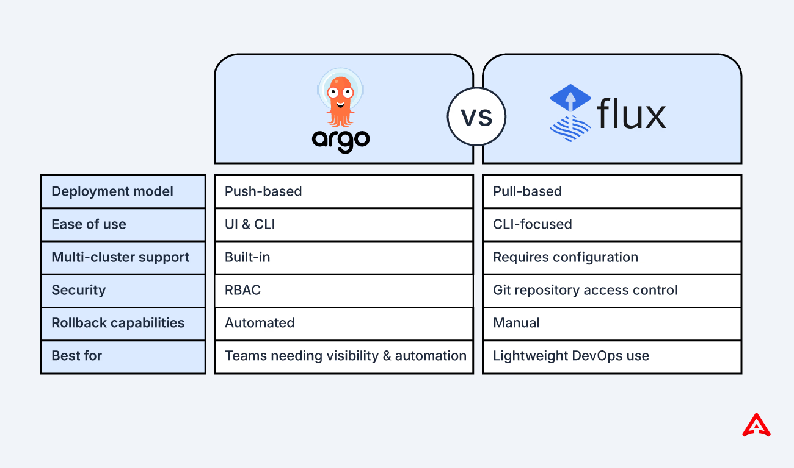

# Argo Cd Flux Comparison

January 8, 2024
Christian Hernandez

* tools | Kubernetes ecosystem / follow GitOps paradigm
  * Argo CD
  * Flux

## NON-features related

* BOTH
  * large 
    * community
    * user base
  * SAME goal: make life easier in Kubernetes -- via -- GitOps
  * CNCF graduation status

## Features

| Feature                                                                                              | Argo CD | Flux      |
|------------------------------------------------------------------------------------------------------|---------|-----------|
| OpenGitOps Compliant (core GitOps Functionality)                                                     | Yes     | Yes       |
| Support for Helm and Kustomized deployments                                                          | Yes     | Yes       |
| Native UI                                                                                            | Yes     | No        |
| Native Bootstrapping Capability                                                                      | No      | Yes       |
| Multi-tenant Support                                                                                 | Yes     | Yes       |
| Support for Partial/Selective Syncs                                                                  | Yes     | Helm Only |
| Support for Native Helm CLI Tooling                                                                  | No      | Yes       |
| Natively Support Helm diff-ing and reconciliation                                                    | Yes     | Yes       |
| Support for Enterprise SSO Integrations                                                              | Yes     | No        |
| Pause/Restart reconciliation for incident handling                                                   | Yes     | Yes       |
| Support for hooks to pre/post jobs                                                                   | Yes     | via Helm  |
| Feature Rich RBAC System                                                                             | Yes     | No        |
| Support for extending Configuration Management tools                                                 | Yes     | No        |
| Deployment model (== how to deploy \| Kubernetes cluster)    &nbsp;&nbsp; != pull -- from -- Git | Push    | Pull      |

* [Argo CD vs Flux whitepaper](argo-flux-whitepaper-2024edition.md)
