# Secret Ingredients Of Continuous Delivery | Enterprise Scale -- thanks to -- Argocd

Authors: Yuan Tang (Akuity), Hong Wang (Akuity), and Alexander Matyushentsev (Intuit)

* == recap | KubeCon China 2021 talk

* goal
  * best practices of using Argo CD | enterprise-scale
  * how does Argo CD work?

* Argo CD
  * can 
    * support x1000 of applications
    * connect to x100 Kubernetes clusters 
    * manage x1000 Kubernetes objects | 1! ArgoCD application

# What is Argo?

The Argo project is a set of Kubernetes-native tools for deploying and running jobs and applications
* It uses GitOps paradigms such as continuous delivery and progressive delivery and enables MLOps on Kubernetes
* It is made of 4 independent Kubernetes-native projects
* We see teams use different combinations of those products to solve their unique challenges
* If you would like to share your Argo journey, please reach out to us at CNCF Argo Slack channel, we will invite you to present at our community meetings, related conferences, and meetups.

We have a very strong community, the product has been recognized and used by a lot of companies
* It is being adopted as the de facto Kubernetes-native GitOps solution and the data processing engine.

We got accepted as the CNCF incubator project
* The project has accumulated more than 20 thousand GitHub stars, 600 contributors, as well as 350 end user companies
* We are very proud of the current progress and enjoy being part of the open source community
* We are working actively towards the CNCF graduation.

GitOps Operator
Before we deep dive into scalability challenges, let's talk about GitOps in general
* First, what is GitOps? One of the definitions is: GitOps is a set of practices to manage infrastructure and application configurations using Git.

That means any GitOps operator needs to automate the following steps in sequence:

Retrieve manifests from Git by cloning the Git repository (e.g
* GitHub, GitLab)

Compare Git manifests with live resources in the Kubernetes cluster using kubectl diff

Finally use kubectl apply to push changes into the Kubernetes cluster

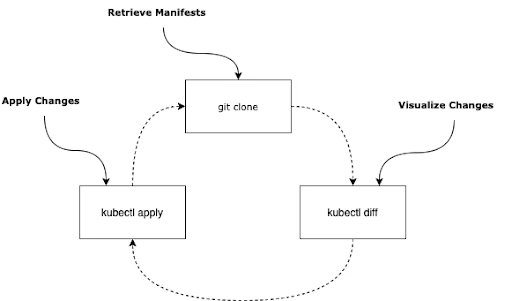

This is exactly what Argo CD does
* The GitOps workflow does not seem to be too difficult, however the devil is in the details
* Let's go ahead and find out what can go wrong when implementing this GitOps workflow and what you can do about it.

Argo CD Architecture
First, let's take a look at Argo CD architecture
* It has three main components: one for each GitOps operator function:

Argo CD repo server is responsible for cloning the git repository and extracting the Kubernetes resources manifests.

Argo CD application controller fetches the managed Kubernetes cluster resources and compares the live resources manifests with Git manifests for each application.

Argo CD API server presents the diffing result (between live manifests and manifests stored in git) to the end user.

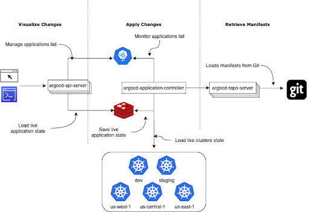

Now you may be wondering - why are there so many components? Why not just pack everything into one small application that performs all three GitOps functions?

Multi-Tenancy

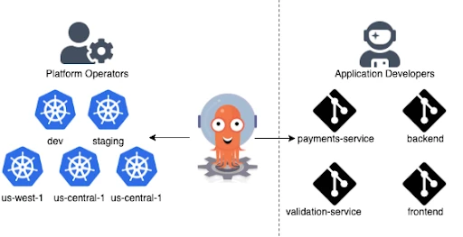

The reason is that Argo CD is delivering GitOps functionality as a service to multiple teams
* It is able to manage multiple clusters, retrieve manifests from multiple Git repositories, and service multiple independent teams.

In other words, you can enable GitOps for application engineers in your company without having to ask them to run and manage any additional software.

This is extremely important, especially if your organization is adopting Kubernetes and application developers are not Kubernetes experts yet
* The GitOps-as-a-service approach allows to not just enforce best practices but also reduces the number of questions/issues the support team receives from the developers to enable self-service.

Scalability
This also means that Argo CD needs to manage potentially hundreds of Kubernetes clusters, retrieve manifests from thousands of Git repositories and present results to thousands of users
* This is when things might become a little more complicated.

The good news is that Argo CD scales really well out of the box
* Argo CD is optimized to run on top of Kubernetes that enabling users to take full advantage of Kubernetes scalability.

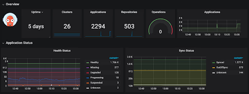

The screenshot above visualizes metrics exposed by an existing Argo CD instance
* As you can see it manages almost 23 hundred applications deployed across 26 clusters with manifests stored in 5 hundred Git repositories
* That means hundreds of application developer teams are using that instance and leveraging GitOps without much overhead.

Unfortunately, no application can scale infinitely and at some point, you might need to tune your configurations to save resources and get better performance in some edge cases
* Let's get started and walk through some of the Argo CD configurations that you might need to tweak.

Application Controller
Too Many Applications
Argo CD's controller runs with multiple workers
* Workers form a pipeline that reconciles applications one by one
* The default number of processes is 20
* This is typically enough to handle hundreds of applications
* However, if you get a thousand or more applications you might start seeing a few hundreds of milliseconds delay
* The delay can increase as you onboard more and more applications.

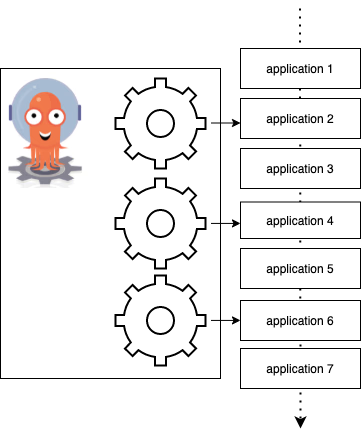

One strategy to improve the performance and reduce delay is to increase the number of workers in the controller
* You can modify it in controller.status.processors inside your Argo CD configmap
* A larger number of workers means that Argo CD will be processing more applications at the same time
* Note that this would also require more memory and CPU so don’t forget to update controller resource requests and limits accordingly.

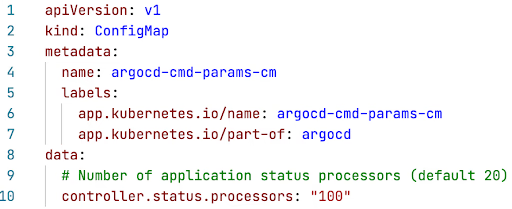

Too Many Clusters
With more and more applications, the controller is going to consume more memory and CPUs
* As some point, it might make sense to run multiple instances of the controller where each one uses less amount of computational resources
* To do so you can leverage the controller sharding feature.

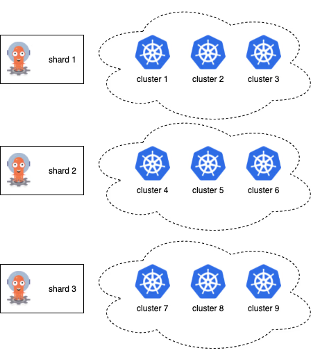

Unlike stateless web applications it is impossible to just run multiple instances of Kubernetes controller
* The challenging part for Argo CD is that controller needs to know the state of the whole managed Kubernetes cluster to properly reconcile application resources
* However you may be running multiple controller instances where each instance is responsible for a subset of Kubernetes clusters.

Sharding can be enabled by increasing the number of replicas in the argocd-application-controller stateful set
* Don’t forgot this update the ARGOCD_CONTROLLER_REPLICAS with the same value
* This is required for the controller instances to know the total number of replicas and to trigger restart to rebalance the work based on updated configurations
* As a result, each controller instances will do less work and consume less memory and CPU resources.

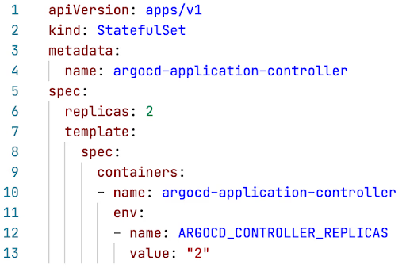

Repo Server
Manifest Generation
The next component that might require tuning is Argo CD repo server
* As mentioned earlier, the repo server is responsible for retrieving the resource manifests from the Git repository
* That means Argo CD needs to clone the repository and retrieve YAML files from the cloned repository.

Cloning the Git repository is not the most challenging task
* One of the GitOps best practices is to separate application source code and deployment manifests, so the deployment repositories are typically small and don't require a lot of disk space
* So if you have a repository with a bunch of plain YAML files then you should be fine and won't need to make any changes in repo server configuration.

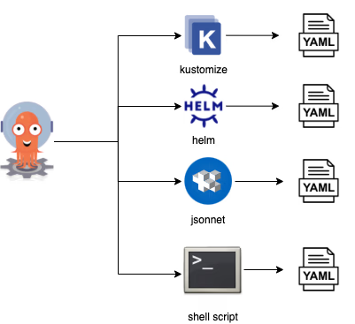

The problem however is that deployment repositories usually don't have plain YAML files
* Instead users prefer to use config management tools such as Kustomize, Helm or Jsonnet
* These tools help developers avoid duplicating YAML content and allow to introduce changes more effectively
* Of course you might ask users to store generated YAML in deployment repository but Argo CD has a better solution: it can run manifest generation on the fly.

Argo CD supports multiple config management tools out of the box and allows to configure any other config management tools
* During manifest generation Argo CD repo-server would exec/fork the config management tool binary and returns the generated manifests, which often requires memory and CPU
* In order to ensure fast manifest generation process, it is recommended to increase number of repo-server replicas.

Mono Repositories
Typically running 3 to 4 repo server instances is enough to handle hundreds or even thousands of Git repositories
* Argo CD aggressively caches generated manifests and doesn't need to re-generate manifests frequently.

However you might encounter some performance issues if you store deployment manifests in so-called mono repositories
* A mono repository is a repository that simply has a lot of applications.

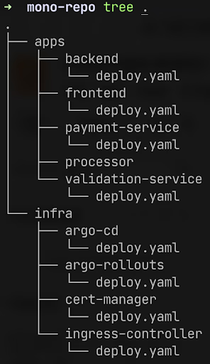

The real world mono repo might have hundreds of applications including infrastructure components as well as multiple microservices
* Typically mono repositories are used to represent desired state of an entire cluster.

This causes some performance challenges
* Each commit to the mono repo invalidates existing cache for all applications in that repo
* That means Argo CD needs to suddenly regenerate manifests for hundreds of applications which causes CPU/Memory spikes
* Some config management tools don't allow concurrent manifest generation
* For example multiple applications that rely on a Helm chart with conditional dependencies have to be processed sequentially.

Limit Parallelism
Generating lots of manifests introduces spikes of CPU and Memory
* The memory spike is the biggest problem since it might cause OOM kills
* To fix it you can limit how number of concurrent manifest generations per repo server instance via reposerver.parallelism.limit
* The number depends on how much memory you are ready to give to the repo server and how much memory your config management tool uses.

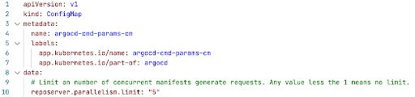

Cache with Webhooks
Next, we'd like to introduce another performance optimization technique that might help you avoid manifest generation spikes completely
* Argo CD invalidates manifests cache for all applications since it does not assume that the generated manifests depend only on files within application related directory
* However this is often the case.

In order to avoid unnecessary invalidating cache when unrelated files are changed you can configure commit webhook and annotate Argo CD application with the argocd.argoproj.io/manifest-generate-paths annotation
* The annotation value should contains list of directories the application depends on
* Every time when webhook notifies Argo CD about a new commit it will inspect the changed files listed in the webhook payload and re-use any generated manifests from a previous commit if new commit does not touch any related files to that application.

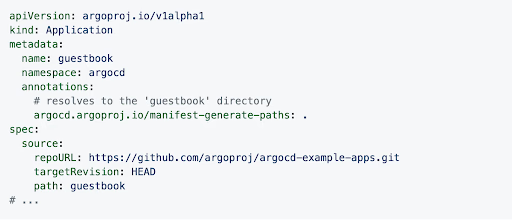

API Server
The API server is a stateless API that scales well horizontally and does not require too much computational resource
* The API server keeps an in-memory cache for all Argo CD applications
* So if you are managing more than 5000 applications using one Argo CD instance you might want to consider adding additional memory limit.

Monitoring and Alerting
Argo CD exposes numerous Prometheus metrics
* A couple of examples can be found below:

argocd_app_reconcile indicates the application reconciliation performance

workqueue_depth that indicates the depth of the controller queue

argocd_app_sync_total counts the number of application sync operations in history

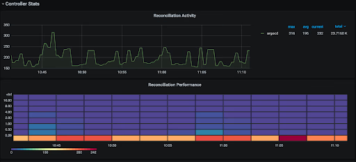

You can use the community maintained Grafana dashboard and review the high availability document for relevant metrics.

Community and Additional Resources
We hope that this article gives you a glimpse of what your development/operations teams can achieve when using Argo CD (and this is just one product from the Argo suite that we have to offer).

For more information please visit Akuity's website and check the additional community-related links below.

A curated list of awesome projects and resources related to Argo

Argo Community Calendar (ICS File)

Argo Project GitHub Organization

Community Governance

Argo at Conferences

ArgoCon

Slack

Twitter

Reddit

Ready to simplify delivery with Akuity?
Deploy, promote, and operate applications reliably, powered by OSS you trust and Intelligence you control.

Request a Demo
Try it for free
Sign Up for Akuity Updates

Practical guidance on MTTR reduction, GitOps at scale, and safe automation, with product updates from the Argo CD and Kargo team.

