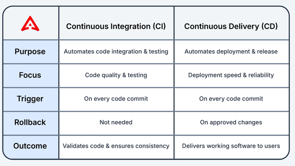
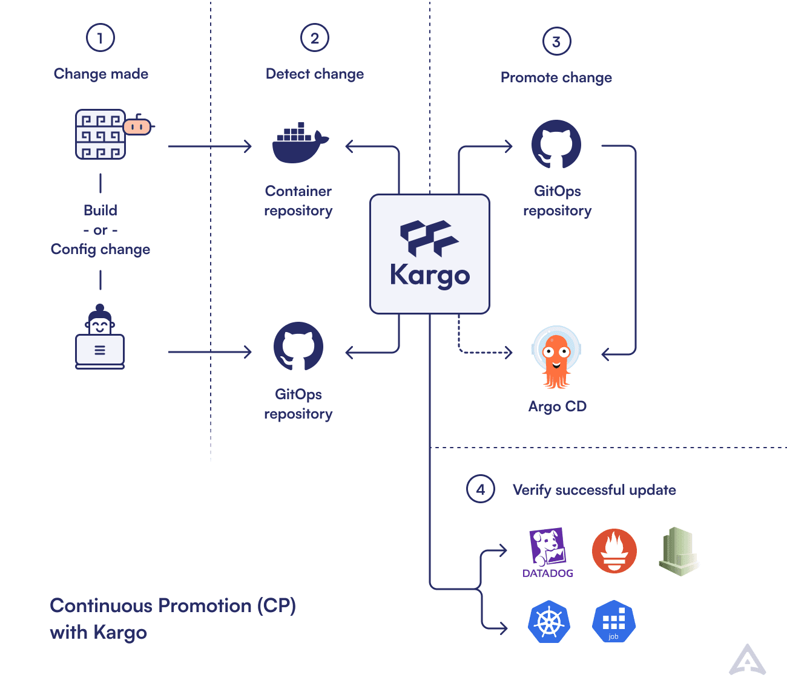

# Why CI/CD need to go their separate ways / Why CI/CD does NOT work for Kubernetes?

* CI & CD
  * == DevOps foundational methodologies /
    * goal: application deployment
      * efficient
      * reliable 
  * CI
    * == frequently merge code changes + automatize (building & testing & creating reliable artifacts)
  * CD
    * == release process /
      * ensure: code is deployable
  * BEFORE ArgoCD
    * ❌NOT ready to handle current technologies (_Examples:_ Kubernetes and GitOps)❌

* Kargo
  * == GitOps continuous promotion tool
    * multi-stage
    * allows
      * orchestrates stage-to-stage deployments -- WITHOUT -- custom scripts OR CI pipelines

## Evolution of CI/CD

* stacks
  * traditional virtual machines OR physical servers
  * containers & Kubernetes ecosystem time
    * dynamic
      * Reason:🧠due to cloud native environments🧠
    * asynchronous
      * Reason:🧠desired vs real🧠
    * MORE complex
      * Reason:🧠interconnected services /
        * OWN dependencies
        * OWN lifecycle🧠

* EXISTING CI/CD processes
  * == linear process == synchronous
    * == build the code + test it + deploy | target environment
    * _Example:_ | scripts, `kubectl apply` & NOT check if ALL was fine
    * Reason why it's fine: 🧠deployment environments were relatively STATIC🧠
  * | traditional virtual machines OR physical servers
    * fine
  * | containers & Kubernetes ecosystem time + GitOps model
    * ⚠️ProblemS⚠️
      * synchronous process | async stack
      * MULTI-environment orchestration | stage-promotion
        * Reason:🧠GitOps
          * goal: reconciliation
          * out of the scope: stage promotion🧠 
      * CI Overload
        * Reason:🧠fix PREVIOUS PROBLEMS🧠

## Continuous Promotion

* Continuous promotion
  * goal
    * bridge the gap BETWEEN CI -- & -- CD | modern technologies (Kubernetes and GitOps)
  * == 💡intermediary step | CI & CD💡 /
    * promote artifacts -- based on -- predefined rules & conditions
    * allows
      * MORE granular control | deployment process /
        * ONLY if artifacts meet specific criteria -> they are promoted
          * _Example of those criterias:_ pass certain tests, receive necessary approvals
        * -> 💡decouples CI and CD processes💡

### benefits

* Stable Deployments
  * Reason:🧠reduce -- , filtering in ONLY qualified artifacts, through the pipeline, -- the risk of faulty deployments🧠

* Deployment Flexibility
  * Reason:🧠supports | MULTIPLE environments, 
    * progressive rollouts
    * phased releases🧠 

* Reduces CI Pipeline Complexity
  * Reason:🧠CI pipelines are overloaded -- with -- deployment tasks🧠

* Automates Decision-Making
  * Reason:🧠predefined rules -- for -- approvals & compliance checks🧠

## Kargo: Bringing Continuous Promotion to Life

* Kargo
  * == tool / 
    * 💡implement [continuous promotion](#continuous-promotion)💡
    * open source 
  * use cases
    * deploy applications | Kubernetes + GitOps environment
    
TODO: 
Kargo operates by monitoring changes to artifacts, such as application images or configuration files, and
applying predefined promotion rules to determine if these artifacts should progress to the next stage of deployment
* This tool effectively bridges the gap between CI and CD by introducing a declarative framework for managing promotions,
ensuring that only vetted changes are deployed.

Kargo does not replace existing CI or CD tools but enhances them by adding an intermediary layer that focuses on
orchestrating promotion of artifacts
* By doing so, it helps facilitate more reliable and efficient deployment processes, reducing the manual effort needed to
manage complex deployments and aligning better with the asynchronous nature of cloud native ecosystems.

### How Kargo Optimizes CI/CD Pipelines

Kargo facilitates continuous promotion by serving as an intermediary that orchestrates the promotion of artifacts 
within the CI/CD pipeline
* It operates by continuously monitoring changes in the repository, such as updates to code, configurations or Docker images.

Based on predefined rules and conditions, Kargo evaluates whether these changes meet the criteria for promotion
* This evaluation considers factors such as successful test results, compliance checks and necessary manual approvals
* Once the conditions are satisfied, Kargo automates the promotion process, updating the GitOps repository to 
reflect the new state and triggering deployments through GitOps controllers like Argo CD.

This approach minimizes the risk of deploying unverified changes, ensuring a higher level of deployment reliability and efficiency
* By utilizing Kargo, teams can reduce manual interventions and streamline their deployment processes, 
allowing CI tools to focus on building artifacts while CD tools manage the rollout
* This integration makes Kargo a vital component in modern, dynamic deployment environments.

