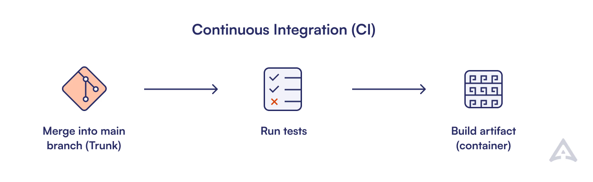
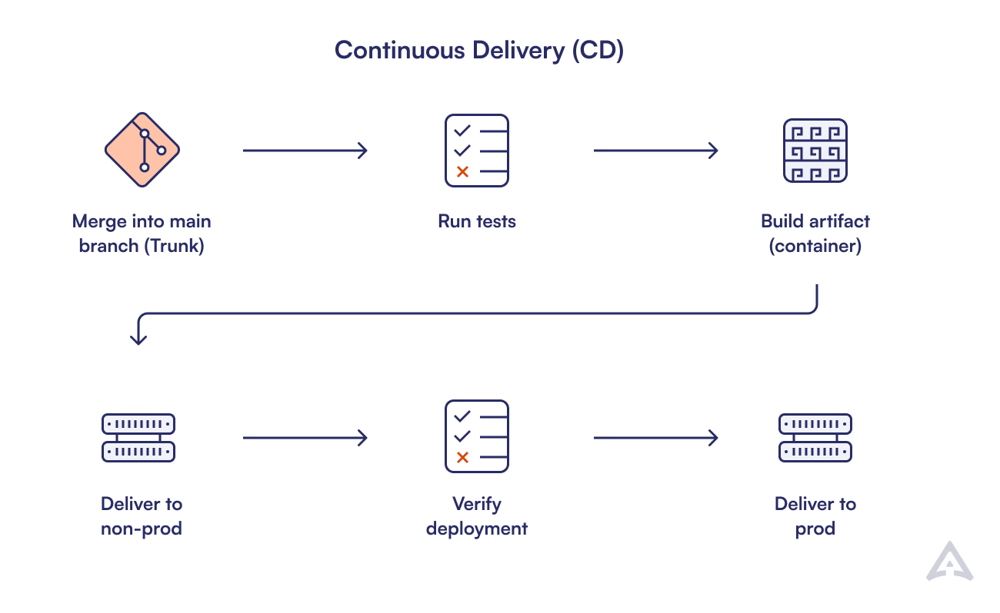
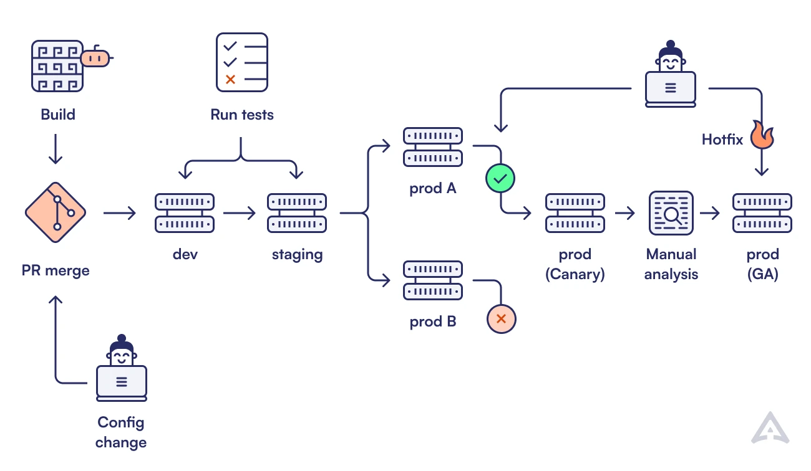
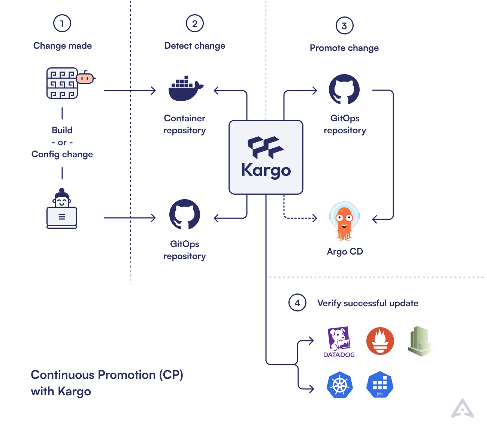

# Why Continuous Promotion

* Continuous Integration and Continuous Deployment (CI/CD)
  * enable
    * AUTOMATED workflows FROM code commit -- to -- production deployment
  * ❌NOT use cases❌
    * cloud-native computing workflows

* cloud-native computing workflows
  * complex 
  * branching pipelines 

* "Continuous Promotion"
  * == promote software-related artifacts -- through -- DIFFERENT stages & environments
    * 's approach
      * solutions
        * MORE adaptable
        * MORE scalable
  * 's features
    * vs conventional CI/CD
      * ADDITIONAL
  * use cases
    * cloud-native computing workflows

## The Evolution of CI and CD
### Origins of Continuous Integration

* Continuous Integration (CI)
  * | early 2000s,
    * origin
  * use cases
    * Agile software development
  * 's goal
    * mitigate integration challenges -- by -- frequently merging code changes (/ live | shared repository)
  * allow
    * detect EARLY integration issues
    * reduce development cycles
    * improve software quality
  * == 👀AUTOMATED testing + AUTOMATED builds 👀
    * Reason:🧠avoid that NEW code does NOT break existing functionality🧠

### Emergence of Continuous Delivery

* Continuous Delivery (CD)
  * 's origin
    * -- from -- Continuous Integration (CI) 
  * 's goal
    * deploy the changes | production
  * allows
    * AUTOMATING deployment

## Modern Application Delivery Challenges
### Complexity of Cloud Native Workflows

* Reason of complexity:
  * ADDITIONAL layers 
    * Reason: 🧠due -- to -- microservices, containerization, and dynamic orchestration🧠
  * branching pipelines
    * Reason: 🧠/ EACH microservice,
      * OWN lifecycle dependencies
      * OWN deployment requirements🧠 

* cons
  * longer development cycles
  * MORE 
    * risk of errors
    * DIFFICULT to maintain consistency ACROSS DIFFERENT environments

### Organizational and Process-related Pains

* TRADITIONAL CI/CD + GitOps methodologies
  * ⚠️pain points⚠️ 
    * PROBLEMS
      * GitOps methodologies overwhelm EXISTING infrastructure
        * Reason:🧠MULTIPLE releases🧠
* TODO: Compliance and security requirements further complicate the deployment pipeline, necessitating manual checks that can delay releases
* Lastly, the need for continuous monitoring and quick rollbacks adds another layer of complexity, 
requiring robust tooling and expertise that many organizations lack.

With all the advantages GitOps gives you, new issues emerge with bespoke CI scripting handling complex promotion processes
* Despite implementing GitOps best practices, organizations still struggle with such challenges as
  * Relying on snowflake scripts run in CI workflows to progress releases and configurations from one stage to another.
  * Losing track of what version is running, where, and what is safe to deploy.
  * Missing a single control plane to view your environments/deploy targets.
  * Not being able to easily revise and audit environment progression history.
  * Introducing guardrails for developers and providing insights to enable developers to perform self-service promotion.
  * Abstracting away the complexity of GitOps principles to empower developers.
  * All of this demands a new set of best practices that are missing and which we choose to call Continuous Promotion.

## The Case for Continuous Promotion
### Why Continuous Promotion Matters
Continuous Promotion fills the gaps left by traditional CI/CD and GitOps methodologies by 
offering a more flexible and scalable approach to modern software deployment.

By continuously promoting code changes through various stages—such as development, staging, and
production—based on predefined criteria and automated checks, it ensures that only the stable and tested versions reach production.

This approach reduces the risk of failures and downtime, making deployments more reliable and efficient
* Additionally, Continuous Promotion enhances collaboration between development and operations teams by providing 
unified framework that aligns with their diverse workflows and priorities
* Ultimately, it enables organizations to innovate faster while maintaining high standards of quality and security.

### Unique Benefits Added to Traditional CI/CD
Continuous Promotion adds several unique benefits to traditional CI/CD practices.

Firstly, it provides greater flexibility by allowing more granular control over the deployment pipeline
* Teams can set specific criteria for promoting code changes through various stages, ensuring that only thoroughly tested and stable versions advance
* This reduces the risk of introducing bugs into production environments.

Secondly, Continuous Promotion enhances scalability, making it easier to manage complex, multi-service architectures typical of cloud-native applications
* It can handle multiple pipelines running concurrently, each with its own set of rules and dependencies.

Lastly, Continuous Promotion fosters better collaboration between development and operations teams by creating a 
unified process that accommodates their respective needs and priorities
* This holistic approach not only improves deployment efficiency but also boosts overall software quality and reliability,
making it an essential component for modern DevOps strategies.

### Kargo: Continuous Promotion with Great Developer Experience
We already see multiple tools and companies trying to address the challenges of Continuous Promotion, 
but let us introduce you to our open-source project, Kargo, 
which was first introduced to the world by the creators of the Argo Project in September 2023.

As an open-source project, Kargo offers a flexible and scalable framework for managing multi-stage deployment pipelines
* It allows teams to define custom promotion criteria and automated checks, ensuring that only the most stable code reaches production.

By integrating seamlessly with existing CI/CD and GitOps tools, Kargo enhances their capabilities without requiring a complete overhaul of current workflows.

Additionally, Kargo provides robust monitoring and rollback mechanisms, allowing for quick recovery in case of failures
* This approach not only improves deployment efficiency but also ensures higher reliability and security, making Kargo a valuable asset for any organization looking to modernize its DevOps practices.

## Summary
Continuous Promotion aims to solve the above mentioned challenges by providing a declarative approach to promotion and removing the need for custom scripting
* This gives organizations better control over their promotion strategies when it comes to GitOps and Kubernetes CI/CD practices.

Continuous Promotion is the final step in the Kubernetes CI/CD maturity model, 
enabling both the application developers and platform engineers to focus on delivering business value in a reliable and continuous fashion.

## Frequently Asked Questions
### What is the meaning of continued promotion?
Continued promotion refers to the automated progression of an application or artifact through different stages of an environment pipeline,
such as dev, staging, and production, based on predefined rules or approvals
* In GitOps workflows, continued promotion ensures that versions move forward only when they meet quality, security, and performance criteria
* This reduces manual steps and accelerates delivery while maintaining consistency across environments
* Many teams use continuous promotion to create safer, repeatable deployment workflows.

### What is ongoing promotion?
Ongoing promotion is the practice of continuously advancing software changes across environments as new commits or artifact versions become available
* It allows teams to automate the movement of updates so that the latest tested and verified version is always promoted forward
* This helps maintain rapid release cycles while enforcing guardrails for stability and compliance
* Ongoing promotion is often used in modern GitOps and continuous delivery pipelines.

### What is the meaning of argo CICD?
Argo CI/CD refers to using Argo’s open-source tools, such as Argo Workflows, Argo CD, and Argo Rollouts, to automate continuous integration and continuous delivery on Kubernetes
* Argo CD handles GitOps-based deployment and continuous promotion of applications, while Argo Workflows manages CI pipelines and automation tasks
* Together, they create a Kubernetes-native CI/CD ecosystem that is declarative, scalable, and fully driven by Git
* This makes Argo a popular choice for teams adopting cloud-native delivery practices.

### What is the process of continuous deployment?
Continuous deployment is the automated process of releasing every code change to production once it passes all required tests and checks
* After code is merged, automated pipelines build, test, validate, and deploy the application without manual intervention
* GitOps tools like Argo CD handle the final promotion step by syncing the desired state from Git to the cluster
* Continuous deployment shortens release cycles, reduces human error, and ensures users get updates as quickly and safely as possible.
