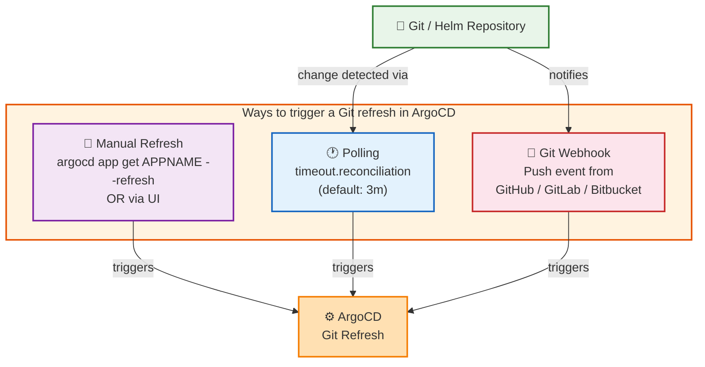

# FAQ

## I've deleted/corrupted my repo and can NOT delete my app.

TODO: 
Argo CD can't delete an app if it cannot generate manifests. You need to either:

1. Reinstate/fix your repo.
1. Delete the app using `--cascade=false` and then manually deleting the resources.

## Why is my application still `OutOfSync` immediately after a successful Sync?

See [Diffing](user-guide/diffing.md) documentation for reasons resources can be OutOfSync, and ways to configure Argo CD
to ignore fields when differences are expected.

## Why is my application stuck in `Progressing` state?

Argo CD provides health for several standard Kubernetes types. The `Ingress`, `StatefulSet` and `SealedSecret` types have known issues
which might cause health check to return `Progressing` state instead of `Healthy`.

* `Ingress` is considered healthy if `status.loadBalancer.ingress` list is non-empty, with at least one value
  for `hostname` or `IP`. Some ingress controllers
  ([contour](https://github.com/projectcontour/contour/issues/403)
  , [traefik](https://github.com/argoproj/argo-cd/issues/968#issuecomment-451082913)) don't update
  `status.loadBalancer.ingress` field which causes `Ingress` to stuck in `Progressing` state forever.

* `StatefulSet` is considered healthy if value of `status.updatedReplicas` field matches to `spec.replicas` field. Due
  to Kubernetes bug
  [kubernetes/kubernetes#68573](https://github.com/kubernetes/kubernetes/issues/68573) the `status.updatedReplicas` is
  not populated. So unless you run Kubernetes version which include the
  fix [kubernetes/kubernetes#67570](https://github.com/kubernetes/kubernetes/pull/67570) `StatefulSet` might stay
  in `Progressing` state.
* Your `StatefulSet` or `DaemonSet` is using `OnDelete` instead of `RollingUpdate` strategy.
  See [#1881](https://github.com/argoproj/argo-cd/issues/1881).
* For `SealedSecret`, see [Why are resources of type `SealedSecret` stuck in the `Progressing` state?](#sealed-secret-stuck-progressing)

As workaround Argo CD allows providing [health check](operator-manual/health.md) customization which overrides default
behavior.

If you are using Traefik for your Ingress, you can update the Traefik config to publish the loadBalancer IP using [publishedservice](https://doc.traefik.io/traefik/providers/kubernetes-ingress/#publishedservice), which will resolve this issue.

```yaml
providers:
  kubernetesIngress:
    publishedService:
      enabled: true
```

## I forgot the admin password, how do I reset it?

* | Argo CD v1.8-,
  * initial password == argocd-server pod name
* | Argo CD v1.9+,
  * initial password is AVAILABLE | `argocd-initial-admin-secret` secret

* ways
  * APPROACH1: 
    * steps to change the password
      * `argocd account bcrypt --password <YOUR-PASSWORD-HERE>`
        * generate a bcrypt hash -- for -- the admin password
      * edit the `argocd-secret` secret and update the `admin.password` field with a new bcrypt hash.

        ```bash
        # bcrypt(password)=$2a$10$rRyBsGSHK6.uc8fntPwVIuLVHgsAhAX7TcdrqW/RADU0uh7CaChLa
        kubectl -n argocd patch secret argocd-secret \
          -p '{"stringData": {
            "admin.password": "$2a$10$rRyBsGSHK6.uc8fntPwVIuLVHgsAhAX7TcdrqW/RADU0uh7CaChLa",
            "admin.passwordMtime": "'$(date +%FT%T%Z)'"
          }}'
        ```

  * APPROACH2: 
    * | "argocd-secret", delete
      * `admin.password` key
      * `admin.passwordMtime` key
    * restart argocd-server
      * -> generate NEW admin initial password
    * `argocd admin initial-password -n argocd`
      * retrieve it

## How to disable admin user?

* [here](./operator-manual/user-management/index.md#disable-admin-user)

## Argo CD cannot deploy Helm Chart based applications without internet access, how can I solve it?

Argo CD might fail to generate Helm chart manifests if the chart has dependencies located in external repositories. To
solve the problem you need to make sure that `requirements.yaml`
uses only internally available Helm repositories. Even if the chart uses only dependencies from internal repos Helm
might decide to refresh `stable` repo. As workaround override
`stable` repo URL in `argocd-cm` config map:

```yaml
data:
  repositories: |
    - type: helm
      url: http://<internal-helm-repo-host>:8080
      name: stable
```

## AFTER deploying my Helm application -- with -- Argo CD, I can NOT see it -- through -- `helm ls` OR OTHER `helm` commands

rollback commands

* Argo CD
  * 💡is neutral -- to -- ALL manifest generators💡
  * | deploy Helm application,
    * steps
      * generate -- , through `helm template` -- a manifest
      * deploy the manifest
        * ❌NOT -- through -- `helm install`❌
          * -> ❌you can NOT check -- via -- any `helm` command ❌
    * FULLY managed -- by -- Argo CD
    * CLI vs Helm commands
      * `argocd app history`
      * `argocd app rollback`

## I've configured [cluster secret](./operator-manual/declarative-setup.md#clusters) but it does not show up in CLI/UI, how do I fix it?

Check if cluster secret has `argocd.argoproj.io/secret-type: cluster` label. If secret has the label but the cluster is
still not visible then make sure it might be a permission issue. Try to list clusters using `admin` user
(e.g. `argocd login --username admin && argocd cluster list`).

## Argo CD is unable to connect to my cluster, how do I troubleshoot it?

Use the following steps to reconstruct configured cluster config and connect to your cluster manually using kubectl:

```bash
kubectl exec -it <argocd-pod-name> bash # ssh into any argocd server pod
argocd admin cluster kubeconfig https://<cluster-url> /tmp/config --namespace argocd # generate your cluster config
KUBECONFIG=/tmp/config kubectl get pods # test connection manually
```

Now you can manually verify that cluster is accessible from the Argo CD pod.

## How Can I Terminate A Sync?

To terminate the sync, click on the "synchronization" then "terminate":

 

## Why Is My App `Out Of Sync` Even After Syncing?

In some cases, the tool you use may conflict with Argo CD by adding the `app.kubernetes.io/instance` label. E.g. using
Kustomize common labels feature.

Argo CD automatically sets the `app.kubernetes.io/instance` label and uses it to determine which resources form the app.
If the tool does this too, this causes confusion. You can change this label by setting
the `application.instanceLabelKey` value in the `argocd-cm`. We recommend that you use `argocd.argoproj.io/instance`.

> [!NOTE]
> When you make this change your applications will become out of sync and will need re-syncing.

See [#1482](https://github.com/argoproj/argo-cd/issues/1482).

## How often does Argo CD check for changes | Git OR Helm repository ?

* frequency / Argo CD poll changes -- from -- Git OR helm repository
  * == `data.timeout.reconciliation` + `data.timeout.reconciliation.jitter`
    * by default, EACH 3' 
    * _Example:_ [here](/docs/operator-manual/examples/argocd-cm.yaml)
  * specified | "argocd-cm" ConfigMap,
    * `data.timeout.reconciliation`
      * ⚠️if you set 0 -> disables AUTOMATIC polling⚠️
        * requirements    
          * configure `ARGOCD_DEFAULT_CACHE_EXPIRATION`
        * -> use ANOTHER approachways / Argo CD detect changes
          * trigger -- through -- webhooks TODO:
          * manual refresh
        * ❌NOT recommended❌
          * Reason: 🧠 
            * failure of webhooks -- due to -- network issues
            * misconfiguration🧠
    * `data.timeout.reconciliation.jitter`

* ⭐️ways to trigger reconcile process ⭐️
  * Argo CD poll configuration
  * [webhooks](operator-manual/webhook.md)
  * MANUAL refresh
    * -- via -- CLI
      * `--refresh` 
        * `argocd app get APPNAME --refresh`
    * -- via -- Argo CD UI

* recommendations
  * if you set Argo CD poll + Git webhook -> set `timeout.reconciliation` = low (_Example:_ `15m`, `1h`)
    * Reason:🧠improve Argo CD performance / resource consumption🧠



## Why is my ArgoCD application `Out Of Sync` when there are no actual changes to the resource limits (or other fields with unit values)?

Kubernetes has normalized your resource limits when they are applied, and then Argo CD has compared the version in
your generated manifests from git to the normalized ones in the Kubernetes cluster - they may not match.

E.g.

* `'1000m'` normalized to `'1'`
* `'0.1'` normalized to `'100m'`
* `'3072Mi'` normalized to `'3Gi'`
* `3072` normalized to `'3072'` (quotes added)
* `8760h` normalized to `8760h0m0s`

To fix this use [diffing customizations](./user-guide/diffing.md#known-kubernetes-types-in-crds-resource-limits-volume-mounts-etc).

## How Do I Fix `invalid cookie, longer than max length 4093`?

Argo CD uses a JWT as the auth token. You likely are part of many groups and have gone over the 4KB limit which is set
for cookies. You can get the list of groups by opening "developer tools -> network"

* Click log in
* Find the call to `<argocd_instance>/auth/callback?code=<random_string>`

Decode the token at [https://jwt.io/](https://jwt.io/). That will provide the list of teams that you can remove yourself
from.

See [#2165](https://github.com/argoproj/argo-cd/issues/2165).

## Why Am I Getting `rpc error: code = Unavailable desc = transport is closing` When Using The CLI?

Maybe you're behind a proxy that does not support HTTP 2? Try the `--grpc-web` flag:

```bash
argocd ... --grpc-web
```

## Why Am I Getting `x509: certificate signed by unknown authority` When Using The CLI?

The certificate created by default by Argo CD is not automatically recognised by the Argo CD CLI, in order
to create a secure system you must follow the instructions to [install a certificate](operator-manual/tls.md)
and configure your client OS to trust that certificate.

If you're not running in a production system (e.g. you're testing Argo CD out), try the `--insecure` flag:

```bash
argocd ... --insecure
```

> [!WARNING]
> Do not use `--insecure` in production.

## I have configured Dex via `dex.config` in `argocd-cm`, it still says Dex is unconfigured. Why?

Most likely you forgot to set the `url` in `argocd-cm` to point to your Argo CD as well. See also
[the docs](./operator-manual/user-management/index.md#2-configure-argo-cd-for-sso).

## Why are `SealedSecret` resources reporting a `Status`?

Versions of `SealedSecret` up to and including `v0.15.0` (especially through helm `1.15.0-r3`) don't include
a [modern CRD](https://github.com/bitnami-labs/sealed-secrets/issues/555) and thus the status field will not
be exposed (on k8s `1.16+`). If your Kubernetes deployment is [modern](
https://www.openshift.com/blog/a-look-into-the-technical-details-of-kubernetes-1-16), ensure you're using a
fixed CRD if you want this feature to work at all.

## <a name="sealed-secret-stuck-progressing"></a>Why are resources of type `SealedSecret` stuck in the `Progressing` state?

The controller of the `SealedSecret` resource may expose the status condition on resource it provisioned. Since
version `v2.0.0` Argo CD picks up that status condition to derive a health status for the `SealedSecret`.

Versions before `v0.15.0` of the `SealedSecret` controller are affected by an issue regarding this status
conditions updates, which is why this feature is disabled by default in these versions. Status condition updates may be
enabled by starting the `SealedSecret` controller with the `--update-status` command line parameter or by setting
the `SEALED_SECRETS_UPDATE_STATUS` environment variable.

To disable Argo CD from checking the status condition on `SealedSecret` resources, add the following resource
customization in your `argocd-cm` ConfigMap via `resource.customizations.health.<group_kind>` key.

```yaml
resource.customizations.health.bitnami.com_SealedSecret: |
  hs = {}
  hs.status = "Healthy"
  hs.message = "Controller doesn't report resource status"
  return hs
```

## How do I fix `The order in patch list … doesn't match $setElementOrder list: …`?

An application may trigger a sync error labeled a `ComparisonError` with a message like:

> The order in patch list: [map[name:**KEY_BC** value:150] map[name:**KEY_BC** value:500] map[name:**KEY_BD** value:250] map[name:**KEY_BD** value:500] map[name:KEY_BI value:something]] doesn't match $setElementOrder list: [map[name:KEY_AA] map[name:KEY_AB] map[name:KEY_AC] map[name:KEY_AD] map[name:KEY_AE] map[name:KEY_AF] map[name:KEY_AG] map[name:KEY_AH] map[name:KEY_AI] map[name:KEY_AJ] map[name:KEY_AK] map[name:KEY_AL] map[name:KEY_AM] map[name:KEY_AN] map[name:KEY_AO] map[name:KEY_AP] map[name:KEY_AQ] map[name:KEY_AR] map[name:KEY_AS] map[name:KEY_AT] map[name:KEY_AU] map[name:KEY_AV] map[name:KEY_AW] map[name:KEY_AX] map[name:KEY_AY] map[name:KEY_AZ] map[name:KEY_BA] map[name:KEY_BB] map[name:**KEY_BC**] map[name:**KEY_BD**] map[name:KEY_BE] map[name:KEY_BF] map[name:KEY_BG] map[name:KEY_BH] map[name:KEY_BI] map[name:**KEY_BC**] map[name:**KEY_BD**]]


There are two parts to the message:

1. `The order in patch list: [`

    This identifies values for items, especially items that appear multiple times:

    > map[name:**KEY_BC** value:150] map[name:**KEY_BC** value:500] map[name:**KEY_BD** value:250] map[name:**KEY_BD** value:500] map[name:KEY_BI value:something]

    You'll want to identify the keys that are duplicated -- you can focus on the first part, as each duplicated key will appear, once for each of its value with its value in the first list. The second list is really just

   `]`

2. `doesn't match $setElementOrder list: [`

    This includes all of the keys. It's included for debugging purposes -- you don't need to pay much attention to it. It will give you a hint about the precise location in the list for the duplicated keys:

    > map[name:KEY_AA] map[name:KEY_AB] map[name:KEY_AC] map[name:KEY_AD] map[name:KEY_AE] map[name:KEY_AF] map[name:KEY_AG] map[name:KEY_AH] map[name:KEY_AI] map[name:KEY_AJ] map[name:KEY_AK] map[name:KEY_AL] map[name:KEY_AM] map[name:KEY_AN] map[name:KEY_AO] map[name:KEY_AP] map[name:KEY_AQ] map[name:KEY_AR] map[name:KEY_AS] map[name:KEY_AT] map[name:KEY_AU] map[name:KEY_AV] map[name:KEY_AW] map[name:KEY_AX] map[name:KEY_AY] map[name:KEY_AZ] map[name:KEY_BA] map[name:KEY_BB] map[name:**KEY_BC**] map[name:**KEY_BD**] map[name:KEY_BE] map[name:KEY_BF] map[name:KEY_BG] map[name:KEY_BH] map[name:KEY_BI] map[name:**KEY_BC**] map[name:**KEY_BD**]

   `]`

In this case, the duplicated keys have been **emphasized** to help you identify the problematic keys. Many editors have the ability to highlight all instances of a string, using such an editor can help with such problems.

The most common instance of this error is with `env:` fields for `containers`.

> [!NOTE]
> **Dynamic applications**
>
> It's possible that your application is being generated by a tool in which case the duplication might not be evident within the scope of a single file. If you have trouble debugging this problem, consider filing a ticket to the owner of the generator tool asking them to improve its validation and error reporting.

## How to rotate Redis secret?
* Delete `argocd-redis` secret in the namespace where Argo CD is installed.
```bash
kubectl delete secret argocd-redis -n <argocd namespace>
```
* If you are running Redis in HA mode, restart Redis in HA.
```bash
kubectl rollout restart deployment argocd-redis-ha-haproxy
kubectl rollout restart statefulset argocd-redis-ha-server
```
* If you are running Redis in non-HA mode, restart Redis.
```bash
kubectl rollout restart deployment argocd-redis
```
* Restart other components.
```bash
kubectl rollout restart deployment argocd-server argocd-repo-server
kubectl rollout restart statefulset argocd-application-controller
```

## How to turn off Redis auth if users really want to?

Argo CD default installation is now configured to automatically enable Redis authentication.
If for some reason authenticated Redis does not work for you and you want to use non-authenticated Redis, here are the steps:

1. You need to have your own Redis installation.
2. Configure Argo CD to use your own Redis instance, as shown in the [example configuration](operator-manual/examples/argocd-cmd-params-cm.yaml).
3. If you already installed Redis shipped with Argo CD, you also need to clean up the existing components:

    * When HA Redis is used:

        - kubectl delete deployment argocd-redis-ha-haproxy
        - kubectl delete statefulset argocd-redis-ha-server

    * When non-HA Redis is used:

        - kubectl delete deployment argocd-redis

4. Remove environment variable `REDIS_PASSWORD` from the following manifests:
    * Deployment: argocd-repo-server
    * Deployment: argocd-server
    * StatefulSet: argocd-application-controller

5. If you have configured file-based Redis credentials using the `REDIS_CREDS_DIR_PATH` environment variable, remove this environment variable and delete the corresponding volume and volumeMount entries that mount the credentials directory from the following manifests:
    * Deployment: argocd-repo-server
    * Deployment: argocd-server
    * StatefulSet: argocd-application-controller

## How do I provide my own Redis credentials?
The Redis password is stored in Kubernetes secret `argocd-redis` with key `auth` in the namespace where Argo CD is installed.
You can config your secret provider to generate Kubernetes secret accordingly.

### Using file-based Redis credentials via `REDIS_CREDS_DIR_PATH`

Argo CD components support reading Redis credentials from files mounted at a specified path inside the container.

When the environment variable `REDIS_CREDS_DIR_PATH` is specified, it takes precedence and Argo CD components that require redis connectivity ( application-controller, repo-server and server) loads the redis credentials from the files located in the specified directory path and ignores any values set in the  environment variables

Expected files when using `REDIS_CREDS_DIR_PATH`:

- `auth`: Redis password (mandatory)
- `auth_username`: Redis username
- `sentinel_auth`: Redis Sentinel password
- `sentinel_username`: Redis Sentinel username

You can store these keys in a Kubernetes Secret and mount it into each Argo CD component that needs Redis access. Then point `REDIS_CREDS_DIR_PATH` to the mount directory.

Example Secret:

```yaml
apiVersion: v1
kind: Secret
metadata:
  name: <secret-name>
  namespace: argocd
type: Opaque
stringData:
  auth: "<redis-password>"
  auth_username: "<redis-username>"
  sentinel_auth: "<sentinel-password>"
  sentinel_username: "<sentinel-username>"
```

Example Argo CD component spec (e.g., add to `argocd-server`, `argocd-repo-server`, `argocd-application-controller`):

```yaml
spec:
    containers:
    - name: argocd-server
      image: quay.io/argoproj/argocd:<version>
      env:
      - name: REDIS_CREDS_DIR_PATH
        value: "/var/run/secrets/redis"
        volumeMounts:
        - name: redis-creds
          mountPath: "/var/run/secrets/redis"
          readOnly: true
    volumes:
    - name: redis-creds
      secret:
       secretName: <secret-name>
```

> [!NOTE]
> This mechanism configures authentication for Argo CD components that connect to Redis. The Redis server itself should be configured independently (e.g., via `redis.conf`).

## How do I fix `Manifest generation error (cached)`?

`Manifest generation error (cached)` means that there was an error when generating manifests and that the error message has been cached to avoid runaway retries.

Doing a hard refresh (ignoring the cached error) can overcome transient issues. But if there's an ongoing reason manifest generation is failing, a hard refresh will not help.

Instead, try searching the repo-server logs for the app name in order to identify the error that is causing manifest generation to fail.

## How do I fix `field not declared in schema`?

For certain features, Argo CD relies on a static (hard-coded) set of schemas for built-in Kubernetes resource types.

If your manifests use fields which are not present in the hard-coded schemas, you may get an error like `field not 
declared in schema`.

The schema version is based on the Kubernetes libraries version that Argo CD is built against. To find the Kubernetes 
version for a given Argo CD version, navigate to this page, where `X.Y.Z` is the Argo CD version:

```
https://github.com/argoproj/argo-cd/blob/vX.Y.Z/go.mod
```

Then find the Kubernetes version in the `go.mod` file. For example, for Argo CD v2.11.4, the Kubernetes libraries 
version is v0.26.11

```
	k8s.io/api => k8s.io/api v0.26.11
```

### How do I fix the issue?

To completely resolve the issue, upgrade to an Argo CD version which contains a static schema supporting all the needed
fields.

### How do I work around the issue?

As mentioned above, only certain Argo CD features rely on the static schema: 1) `ignoreDifferences` with 
`managedFieldManagers`, 2) server-side apply _without_ server-side diff, and 3) server-side diff _with_ mutation 
webhooks. 

If you can avoid using these features, you can avoid triggering the error. The options are as follows:

1. **Disable `ignoreDifferences` which have `managedFieldsManagers`**: see [diffing docs](user-guide/diffing.md) for
   details about that feature. Removing this config could cause undesired diffing behavior.
2. **Disable server-side apply**: see [server-side apply docs](user-guide/sync-options.md#server-side-apply) for details about that
   feature. Disabling server-side apply may have undesired effects on sync behavior. Note that you can bypass this issue 
   if you use server-side diff and [exclude mutation webhooks from the diff](user-guide/diff-strategies.md#mutation-webhooks).
   Excluding mutation webhooks from the diff could cause undesired diffing behavior.
3. **Disable mutation webhooks when using server-side diff**: see [server-side diff docs](user-guide/diff-strategies.md#mutation-webhooks)
   for details about that feature. Disabling mutation webhooks may have undesired effects on sync behavior.

### How do I fix `grpc: error while marshaling: string field contains invalid UTF-8`?

On Kubernetes v1.34.x clusters, Argo CD components may stop working and pods may 
fail to start with errors such as:

```
Error: grpc: error while marshaling: string field contains invalid UTF-8
```
This issue typically affects pods that reference Kubernetes secrets via environment variables, e.g. 
```yaml
env:
  - name: REDIS_PASSWORD
    valueFrom:
      secretKeyRef:
        name: argocd-redis
        key: auth
        optional: false
```
Kubernetes environment variables must be valid UTF-8 strings. In affected clusters, the argocd-redis Secret contained non-UTF-8 (binary) data, while other clusters used
ASCII-only values.

#### How do I fix the issue?
Inspect the decoded Redis password
```bash
kubectl get -n argocd secret argocd-redis -o json \
    | jq -r '.data.auth' | base64 --decode | xxd
```
If the output contains non-printable characters or bytes outside the UTF-8 range, the Secret is invalid for use as an
environment variable. It is recommended to regenerate the secret using a UTF-8-safe password.