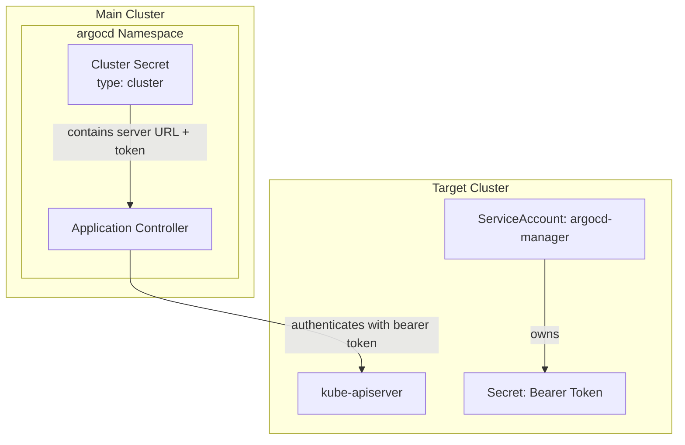

# Cluster Management

* goal
  * how to manage clusters -- through -- CLI
* audience
  * operators

* ways
  * [declaratively](./declarative-setup.md#clusters)
  * [`argocd cluster` Command Reference](../user-guide/commands/argocd_cluster.md)

## "in-cluster"

* == default cluster | ArgoCD is installed

* 👀if you want to disable deploying ArgoCD Applications | `in-cluster` cluster -> | "argocd-cm" ConfigMap, set `.data.cluster.inClusterEnabled: "false"`👀
  * -> ❌by default, you can NOT deploy Argo CD Applications❌

## how to add a cluster?

* requirements
  * [Cluster credentials](declarative-setup.md#cluster-credentials)

* allows
  * 💡Argo CD can deploy Applications | MULTIPLE clusters (EVEN != cluster | Argo CD is installed)💡
    * Reason:🧠
      * ArgoCD does NOT have access -- to your -- local kubeconfig
      * OTHERWISE, Argo CD can NOT install Applications | OTHER clusters🧠

### declaratively
* [here](./declarative-setup.md#clusters)

### `argocd cluster add contextName` 

* ⚠️requirements⚠️
  * privileged access -- to the -- cluster
  * `contextName` MUST ALREADY exist
    * check the AVAILABLE one -- via -- `kubectl config get-contexts`

* what does Argo CD under the hood?
  1. | target cluster, 
     * | Kubernetes v1.24-, NOTHING
       * Reason:🧠managed by Kubernetes itself🧠
     * | Kubernetes v1.24+, creates
       * SA "argocd-manager"  / FULL cluster RBAC
       * secret -- with -- bearer token
  2. | source cluster's "argocd" namespace, stores -- as a -- Secret / label `argocd.argoproj.io/secret-type: cluster`
     * token
     * server URL
     * TLS
  3. | sync an `Application` / `destination.server: https://...`, Application Controller connect -- , via that Secret, to -- that cluster



* FUTURE enhancements
  * [Kubernetes TokenRequest API](https://github.com/argoproj/argo-cd/issues/9610)

## how to skip cluster reconciliation?

TODO:
You can stop the controller from reconciling a cluster without removing it by annotating its secret:

```bash
kubectl -n argocd annotate secret <cluster-secret-name> argocd.argoproj.io/skip-reconcile=true
```

The cluster will still appear in `argocd cluster list` but the controller will skip reconciliation
for all apps targeting it
* To resume, remove the annotation:

```bash
kubectl -n argocd annotate secret <cluster-secret-name> argocd.argoproj.io/skip-reconcile-
```

See [Declarative Setup - Skipping Cluster Reconciliation](./declarative-setup.md#skipping-cluster-reconciliation) for details.

## how to remove a cluster?

* `argocd cluster rm contextName`

* "in-cluster"
  * ❌can NOT be removed❌
