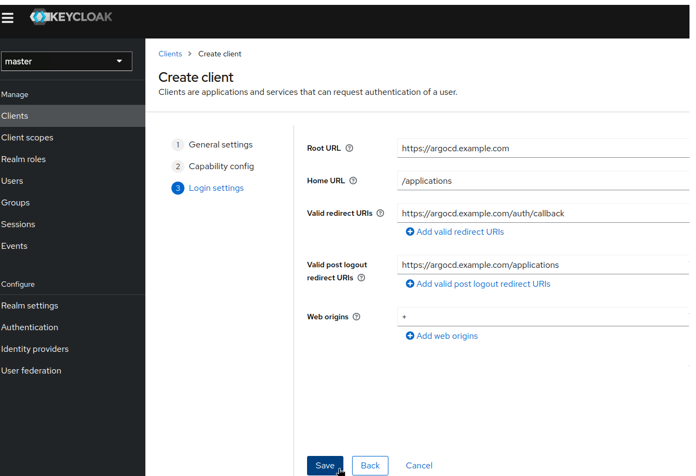
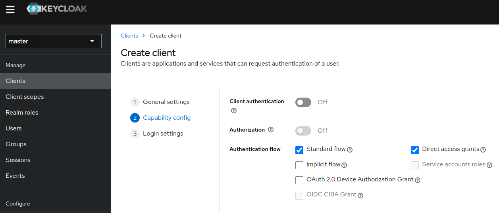
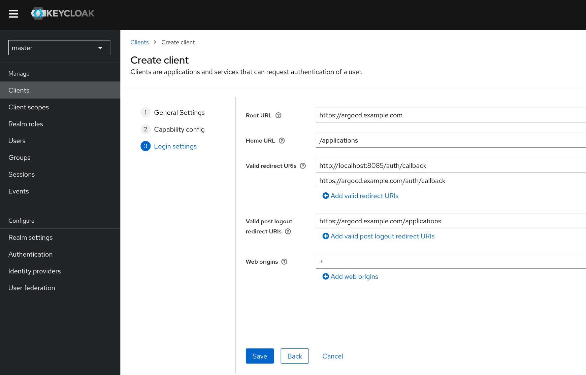
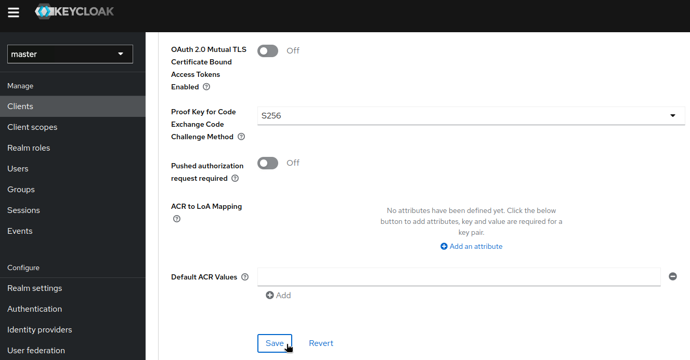
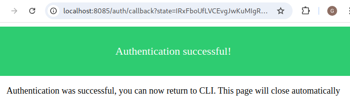

# Keycloak

* ways to configure Keycloak -- & -- ArgoCD
  * [-- via -- Client authentication](#---via----client-authentication)
  * [-- via -- PKCE](#---via----pkce)
    * use cases
      * you authenticate -- via -- `argocd` CL

## -- via -- Client authentication

* goal
  * configure ArgoCD application / can authenticate -- with -- Keycloak
    * steps
      * create a client | Keycloak
        * TODO: using groups set in Keycloak to determine privileges in Argo.
      * configure ArgoCD / can use Keycloak -- for -- authentication

### create a NEW client | Keycloak

* steps
  * | browser's Keycloack URL
    * choose your realm
    * Clients 
      * \> Create client

        
        * \> Next > Client authentication: on

          
        * \> Next > 
          * __Root URL__
            * == https://localhost:8080
          * __Web origins__
            * == +
          * __Admin URL__
            * TODO: ?
          * __Home URL__
            * == /applications 
          * __Valid Post logout redirect URIs__ 
            * == https://localhost:8080/applications
          * __Valid Redirect URIs__
            * == ALLOWED values
              * https://localhost:8080/auth/callback
              * https://localhost:8080/*
                * use cases
                  * testing/development purposes
                * ❌NOT use cases❌
                  * production
      
          

      * \> Choose RECENTLY created client > Credentials > copy the Client Secret

        

### how to configure ArgoCD OIDC?

* steps
  * `kubectl -n argocd patch secret argocd-secret --patch='{"stringData": { "oidc.keycloak.clientSecret": "<REPLACE_WITH_CLIENT_SECRET>" }}'`
  * `kubectl patch configmap argocd-cm -n argocd --type merge --patch-file patchForClientAuthentication.yaml` /
    * __issuer__ 
      * ends -- with the -- realm / contains the clientId
      * | Keycloak v17-,
        * MUST include /auth
          * _Example:_ /auth/realms/master
    * __clientID__
      * == Client ID / you configured | Keycloak
    * __clientSecret__ 
      * points -- to the -- right key / you created | "argocd-secret" Secret
    * __requestedScopes__
      * if you did NOT add it | default scopes -> contain _groups_ claim 
    * __refreshTokenThreshold__ 
      * \< client token lifetime
        * OTHERWISE, a NEW token will be obtained / EACH request
      * by default,
        * 5'

## -- via -- PKCE

* goal
  * create a client | Keycloak
  * configure ArgoCD / authenticate -- through -- Keycloak
    * using groups / set | Keycloak
  * authenticate -- via -- `argocd` CL

### Create a NEW client | Keycloak

First we need to setup a new client.

Start by logging into your keycloak server, select the realm you want to use (`master` by default)
and then go to __Clients__ and click the __Create client__ button at the top.


Leave default values.



Configure the client by setting the __Root URL__, __Web origins__, __Admin URL__ to the hostname (https://{hostname}).

Also you can set __Home URL__ to _/applications_ path and __Valid Post logout redirect URIs__ to "https://{hostname}/applications".

The Valid Redirect URIs should be set to:
- http://localhost:8085/auth/callback (needed for argo-cd cli, depends on value from [--sso-port](../../user-guide/commands/argocd_login.md))
- https://{hostname}/auth/callback



Make sure to click __Save__.

Now go to a tab called __Advanced__, look for parameter named __Proof Key for Code Exchange Code Challenge Method__ and set it to __S256__


Make sure to click __Save__.

### Configuring ArgoCD OIDC
Now we can configure the config map and add the oidc configuration to enable our keycloak authentication.
You can use `$ kubectl edit configmap argocd-cm`.


Make sure that:

- __issuer__ ends with the correct realm (in this example _master_)
- __issuer__ on Keycloak releases older than version 17 the URL must include /auth (in this example /auth/realms/master)
- __clientID__ is set to the Client ID you configured in Keycloak
- __enablePKCEAuthentication__ must be set to true to enable correct ArgoCD behaviour with PKCE
- __requestedScopes__ contains the _groups_ claim if you didn't add it to the Default scopes
- __refreshTokenThreshold__ is less than the client token lifetime.  If this setting is not less than the token lifetime, a new token will be obtained for every request.  Keycloak sets the client token lifetime to 5 minutes by default.

## how to configure the `groups` claim | authentication token?

* steps
  * | __Client Scope__ 

    
    * \> add a Token Mapper / 
      * if the client requests the groups scope -> add the groups claim | token 
      * set
        * "Mapper type" == __Group Membership__
        * __Name__ == __Token Claim Name__
        * "Full group path": off

      
  * | Client,
    * choose the RECENTLY created client > "Client Scopes" > "Add client scope"
      * choose the _groups_ scope 
        * add it | __Default__ Client Scope OR __Optional__ Client Scope
          * if you set __Optional__ -> make sure / ArgoCD requests the scope | its OIDC configuration
          * recommendation
            * use __Default__ Client Scope

    
  * | group,
    * join the user | _ArgoCDAdmins_ group

    

## how to configure the ArgoCD Policy?

Now that we have an authentication that provides groups we want to apply a policy to these groups.
We can modify the _argocd-rbac-cm_ ConfigMap using `$ kubectl edit configmap argocd-rbac-cm`.

```yaml
apiVersion: v1
kind: ConfigMap
metadata:
  name: argocd-rbac-cm
data:
  policy.csv: |
    g, ArgoCDAdmins, role:admin
```

In this example we give the role _role:admin_ to all users in the group _ArgoCDAdmins_.

## Login

You can now login using our new Keycloak OIDC authentication:


If you have used PKCE method, you can also authenticate using command line:
```bash
argocd login argocd.example.com --sso --grpc-web
```

argocd cli will start to listen on localhost:8085 and open your web browser to allow you to authenticate with Keycloak.

Once done, you should see



## Troubleshoot

* restart the "argocd-server" pod
  * `kubectl rollout restart deployment argocd-server -n argocd`
* | migrate FROM Client authentication -- to -- PKCE,
  * Problem: "invalid_request: Missing parameter: code_challenge_method"
    * Solution: 
      * try | private browsing
      * clean browser cookies
