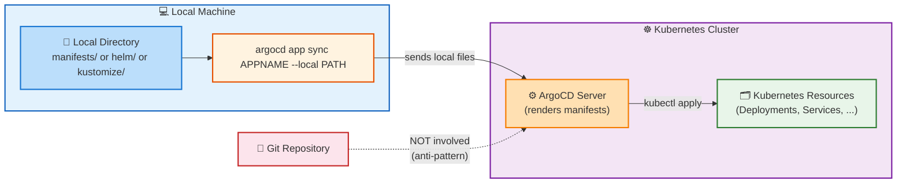

# Tools

## | production

* Argo CD
  * supports
    * 💡MULTIPLE ways to define Kubernetes manifests💡
      * raw yaml
      * [Kustomize](kustomize.md) applications
      * [Helm](helm.md) charts
      * [OCI](oci.md) images
      * [Jsonnet](jsonnet.md) manifests
      * [custom config management tool](../operator-manual/config-management-plugins.md) / configured -- as a -- config management plugin
        * == custom tools
  * 💡[Application's `spec.source`](/manifests/crds/application-crd.yaml)💡
    * == specify application source

* how are those Kubernetes manifests used?
  * Argo CD transforms -- to -- FINAL FULL Kubernetes manifest 

## | development

* Argo CD
  * supports
    * uploading DIRECTLY local manifests -- `argocd app sync APPNAME --local ...` -- 
      * local
        * != push | Git
      * ⚠️anti-pattern of the GitOps paradigm⚠️
        * ONLY ALLOWED | development
      * requirements
        * user / `override` permission
      * ALLOWED | [ANY way to define Kubernetes manifests](#-production)

