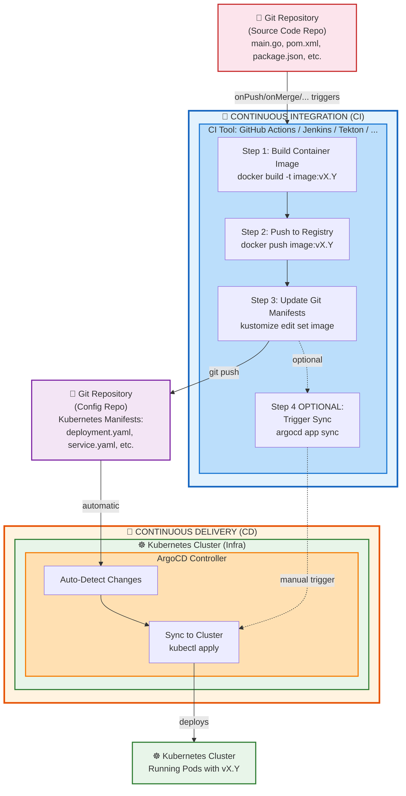

# Automation from CI Pipelines

* goal
  * how to automate CI pipelines / CD is managed -- by -- Argo CD

* != traditional CI pipeline
  * Reason: 🧠declarative vs imperative🧠



## steps

### build & publish a NEW container image

```bash
docker build -t tagName:vX.Y .
docker push tagName:vX.Y
```

* handled -- by -- CI tool

### update the local manifests -- via -- your preferred templating tool + push the changes | Git

```bash
git clone https://github.com/serviceName-config.git
cd serviceName-config

# kustomize
kustomize edit set image tagName:vX.Y

# plain yaml
kubectl patch --local -f config-deployment.yaml -p '{"spec":{"template":{"spec":{"containers":[{"name":"guestbook","image":"mycompany/guestbook:v2.0"}]}}}}' -o yaml > config-deployment.yaml

git commit -am "Update guestbook to v2.0"
git push
```

* recommendations
  * 👀git repository / hold your application source code != git repository / hold your Kubernetes manifests👀
  * [MORE](best_practices.md)

* handled -- by -- CI tool

### Synchronize the app (OPTIONAL)

* `argocd app sync APPNAME`

* handled | CI pipeline
  * ⚠️OPTIONAL⚠️
    * Reason: 🧠if you configure [automated synchronization](auto_sync.md) -> this step is unnecessary🧠

* argocd CLI
  * 👀can be downloaded directly -- from the -- API server👀
    * -> argocd CLI / used | CI pipeline: ALWAYS compatible -- with the -- Argo CD API server

    ```bash
    export ARGOCD_SERVER=argocd.example.com
    export ARGOCD_AUTH_TOKEN=<JWT token generated from project>
    curl -sSL -o /usr/local/bin/argocd https://${ARGOCD_SERVER}/download/argocd-linux-amd64
    argocd app sync guestbook
    argocd app wait guestbook
    ```

* 👀ways of sync👀
  * [automatic sync policy](auto_sync.md)
    * recommended one
  * [`argocd app sync APPNAME`](ci_automation.md)
    * triggered -- by -- CI
    * performed -- by -- Argo CD (`argocd ...`)
