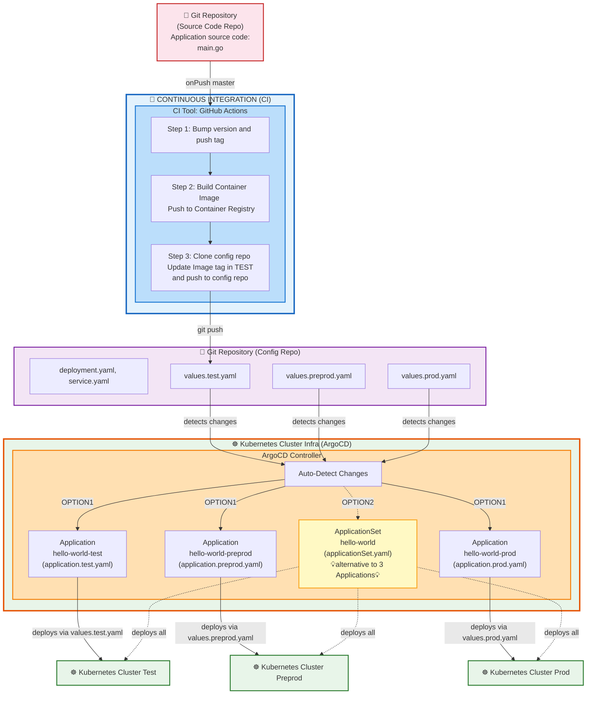

# requirements
* download software / enable you to run local Kubernetes clusters
    * [Docker desktop](https://docs.docker.com/get-started/introduction/get-docker-desktop/)
    * [kind](https://kind.sigs.k8s.io/) + [install Kubectl](https://kubernetes.io/docs/tasks/tools/#kubectl)
    * [minikube](https://minikube.sigs.k8s.io/docs/)
        * `kubectl` commands are wrapped -- via -- `minikube kubectl`
    * [microk8s](https://canonical.com/microk8s)
        * `kubectl` commands are wrapped -- via -- `microk8s kubectl`
* run a local Kubernetes cluster
    * -- via --
        * [Docker Desktop](https://docs.docker.com/desktop/use-desktop/kubernetes/#enable-kubernetes)
            * | Docker Desktop
                * Kubernetes > Create cluster > choose any cluster type
        * [Kind](https://kind.sigs.k8s.io/#installation-and-usage)
            * `kind create cluster`
        * minikube
            * `minikube start`
        * microk8s
    * `kubectl config current-context`
        * check Kubectl points to a context
* [install Argo CD](/docs/operator-manual/installation.md)

# structure

* [source code repo](https://github.com/dancer1325/argo-cd-hello-world-app)
* [config repo](https://github.com/dancer1325/argo-cd-hello-world-config)

# steps
* TODO: 