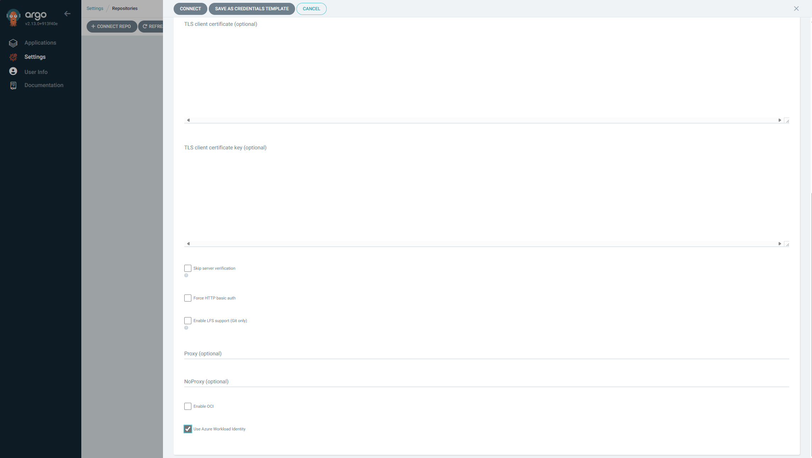
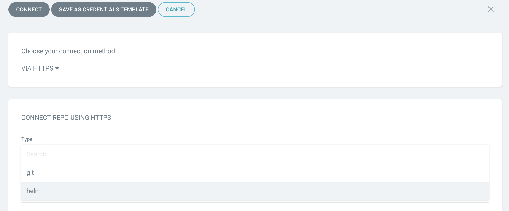

# Private Repositories

* repositories & repository credentials
  * are stored | secrets
  * recommendations
    * 👀-- via -- declaratively, use [secret management](../operator-manual/secret-management.md)👀
      * Reason:🧠secret, NOT raw | Kubernetes secret🧠

## Credentials methods

### Protocol-based
#### HTTPS

* == | Application,
  * `spec.source.repoUrl: https://...`

##### Username & Password

* ways to configure the credentials
  * -- via -- Argo CD CLI

    ```bash
    argocd repo add https://github.com/argoproj/argocd-example-apps --username <username> --password <password>
    ```
  * -- via -- UI
    * steps
      * "Settings/Repositories" > "Connect Repo using HTTPS"
        * enter credentials 

          
        * "Connect"
          * test the connection & add the repository 

          
  * declaratively
    * specify `username` & `password`

* ❌NOT supported by❌
  * [Github](https://github.blog/changelog/2021-08-12-git-password-authentication-is-shutting-down/)
  
* supported by
  * GitLab self-hosted
  * Bitbucket Server on-premise
  * Azure DevOps

##### Access Token

* how to generate the access token |
  * [GitHub](https://help.github.com/en/articles/creating-a-personal-access-token-for-the-command-line)
  * [GitLab](https://docs.gitlab.com/ee/user/project/deploy_tokens/)
  * [Bitbucket](https://confluence.atlassian.com/bitbucketserver/personal-access-tokens-939515499.html)
  * [Azure Repos](https://docs.microsoft.com/en-us/azure/devops/organizations/accounts/use-personal-access-tokens-to-authenticate?view=azure-devops&tabs=preview-page)

* ways to configure the credentials (== [username & password](#username--password))
  * -- via -- Argo CD CLI

    ```bash
    argocd repo add <REPO_URL> --username <USERNAME_GIT_PROVIDER_DEPENDANT> --password <ACCESS_TOKEN>
    ```
    * `<USERNAME_GIT_PROVIDER_DEPENDANT>`
      * ANY non-empty string
      * your account name
      * `x-token-auth`, |
        * BitBucket Cloud
        * BitBucket Data Center
  * -- via -- UI
    * steps
      * "Settings/Repositories" > "Connect Repo using HTTPS"
        * enter credentials
        * "Connect"
          * test the connection & add the repository
  * declaratively
    * specify `username` & `password`

##### TLS Client Certificates

* `tlsClientCertData` & `tlsClientCertKey`
  * ⚠️supported formats⚠️
    * PEM
  * `tlsClientCertKey`
    * requirements
      * ❌NOT password protected❌
        * Reason:🧠otherwise it can NOT be used by Argo CD🧠

* ways to configure the credentials
  * -- via -- `argocd`
    ```
    argocd repo add https://repo.example.com/repo.git --tls-client-cert-path ~/mycert.crt --tls-client-cert-key-path ~/mycert.key
    ```
  * -- via -- UI
    * steps
      * "Settings/Repositories" > "Connect Repo using HTTPS"
        * enter credentials: `tlsClientCertData` & `tlsClientCertKey`
        * "Connect"
          * test the connection & add the repository
  * declaratively

#### SSH

* ⚠️requirements⚠️
  * Git repos
    * ❌NOT valid | helm repos OR OCI repos❌
  * [URL regex](/util/git/git.go)'s `sshURLRegex`
    * `ssh://...`
      * uses
        * SSH repository is served | non-standard port
    * `git@yourgit.com:yourrepo`
      * ❌NOT support❌
        * port specification

* | Argo CD v2.4,
  * OpenSSH 8.9
    * vs OpenSSH 8.8,
      * ❌[NOT support `ssh-rsa` SHA-1 key signature algorithm](https://www.openssh.com/txt/release-8.8)❌
  * [2.3 -- to -- 2.4 upgrade guide](../operator-manual/upgrading/2.3-2.4.md)

* ways to configure the credentials
  * -- via -- `argocd`
    * `argocd repo add git@github.com:argoproj/argocd-example-apps.git --ssh-private-key-path ~/.ssh/id_rsa`
  * -- via -- UI
    * "Settings/Repositories" > "Connect method": SSH
      * enter credentials
      * "Connect"
        * == test the connection
  * declaratively
    * `sshPrivateKey`

* 👀[for unknown SSH hosts](#unknown-ssh-hosts)👀

### Provider-specific
#### GitHub App Credential

* `githubAppPrivateKey`
    * == GitHub App private key -- for -- accessing the repositories
* `githubAppID`
    * == GitHub Application ID -- for the -- application / you created
* `githubAppInstallationID`
    * GitHub app's Installation ID / you created & installed
* `githubAppEnterpriseBaseUrl`
    * base api URL for GitHub Enterprise (e.g. `https://ghe.example.com/api/v3`)
* `tlsClientCertData` & `tlsClientCertKey`
    * `tlsClientCertData`
        * == TLS client certificate

Private repositories that are hosted on GitHub.com or GitHub Enterprise can be accessed using credentials from a GitHub Application
Consult the [GitHub documentation](https://docs.github.com/en/developers/apps/about-apps#about-github-apps) on how to create an application.

> [!NOTE]
> Ensure your application has at least `Read-only` permissions to the `Contents` of the repository. This is the minimum requirement.

You can configure access to your Git repository hosted by GitHub.com or GitHub Enterprise using the GitHub App method by either using the CLI or the UI.

Using the CLI:

```
argocd repo add https://github.com/argoproj/argocd-example-apps.git --github-app-id 1 --github-app-installation-id 2 --github-app-private-key-path test.private-key.pem
```

> [!NOTE]
> To add a private Git repository on GitHub Enterprise using the CLI add `--github-app-enterprise-base-url https://ghe.example.com/api/v3` flag.

> [!NOTE]
> The `--github-app-installation-id` flag is optional. If omitted, Argo CD will automatically discover the installation ID based on the repository's organization.

Using the UI:

1. Navigate to `Settings/Repositories`

    

2. Click `Connect Repo using GitHub App` button, choose type: `GitHub` or `GitHub Enterprise`, enter the URL, App Id, Installation Id (optional), and the app's private key.

> [!NOTE]
> Enter the GitHub Enterprise Base URL for type `GitHub Enterprise`.
> 

3. Click `Connect` to test the connection and have the repository added

> [!NOTE]
> When pasting GitHub App private key in the UI, make sure there are no unintended line breaks or additional characters in the text area

#### Google Cloud Source

Private repositories hosted on Google Cloud Source can be accessed using Google Cloud service account key in JSON format. Consult [Google Cloud documentation](https://cloud.google.com/iam/docs/creating-managing-service-accounts) on how to create a service account.

> [!NOTE]
> Ensure your application has at least `Source Repository Reader` permissions for the Google Cloud project. This is the minimum requirement.

You can configure access to your Git repository hosted on Google Cloud Source using the CLI or the UI.

Using the CLI:

```
argocd repo add https://source.developers.google.com/p/my-google-cloud-project/r/my-repo --gcp-service-account-key-path service-account-key.json
```

Using the UI:

1. Navigate to `Settings/Repositories`

   

2. Click `Connect Repo using Google Cloud Source` button, enter the URL and the Google Cloud service account in JSON format.

   

3. Click `Connect` to test the connection and have the repository added


#### Azure Container Registry/Azure Repos using Azure Workload Identity

Before using this feature, you must perform the following steps to enable workload identity configuration in Argo CD:

- **Label the Pods:** Add the `azure.workload.identity/use: "true"` label to the repo-server pods.
- **Create Federated Identity Credential:** Generate an Azure federated identity credential for the repo-server service account. Refer to the [Federated Identity Credential](https://azure.github.io/azure-workload-identity/docs/topics/federated-identity-credential.html) documentation for detailed instructions.
- **Add Annotation to Service Account:** Add `azure.workload.identity/client-id: "$CLIENT_ID"` annotation to the repo-server service account, using the `CLIENT_ID` from the workload identity.
- **Configure ACR Permissions:** Grant the workload identity the necessary permissions on Azure Container Registry or Azure Repos.
- **Set ACR Token Resource Variable:** Configure the Argo CD repo server env variable `AZURE_ARM_TOKEN_RESOURCE`=https://containerregistry.azure.net so Argo CD can request valid ACR access tokens.

Using CLI for Helm OCI with Azure workload identity:

```
argocd repo add contoso.azurecr.io/charts --type helm --enable-oci --use-azure-workload-identity
```

Using CLI for Azure Repos with Azure workload identity:

```
argocd repo add https://contoso@dev.azure.com/my-projectcollection/my-project/_git/my-repo --use-azure-workload-identity
```

Using the UI:

- Navigate to `Settings/Repositories`

   
- Click on `+ Connect Repo`
- On the connection page:
    - Choose Connection Method as `VIA HTTPS`
    - Select the type as `git` or `helm`
    - Enter the Repository URL
    - Enter name, if the repo type is helm
    - Select `Enable OCI`, if repo type is helm
    - Select `Use Azure Workload Identity`

    
- Click `Connect`

Using secret definition:

```yaml
apiVersion: v1
kind: Secret
metadata:
  name: helm-private-repo
  namespace: argocd
  labels:
    argocd.argoproj.io/secret-type: repository
stringData:
  type: helm
  url: contoso.azurecr.io/charts
  name: contosocharts
  enableOCI: "true"
  useAzureWorkloadIdentity: "true"
---
apiVersion: v1
kind: Secret
metadata:
  name: git-private-repo
  namespace: argocd
  labels:
    argocd.argoproj.io/secret-type: repository
stringData:
  type: git
  url: https://contoso@dev.azure.com/my-projectcollection/my-project/_git/my-repo
  useAzureWorkloadIdentity: "true"
```

## Credential templates

* credential templates
  * allows
    * use the SAME credentials | MULTIPLE repositories
  * ⚠️requirements⚠️
    * | repository, NOT configure at all the repository OR configure WITHOUT credential information
      * == ❌NOT contain `sshPrivateKey`, `username`, `password`❌
    * repository URL == credential template URL + something else
      * _Example:_ https://github.com/argoproj/argocd-example-apps == https://github.com/argoproj + something else
      * ⚠️if there are >1 repo's credential / match -> the longest match take precedence⚠️

TODO: 
You can also set up credentials to serve as templates for connecting repositories, without having to repeat credential configuration
* For example, if you setup credential templates for the URL prefix `https://github.com/argoproj`, these credentials will be used for all repositories with this URL as prefix (e.g
* `https://github.com/argoproj/argocd-example-apps`) that do not have their own credentials configured.

To set up a credential template using the Web UI, simply fill in all relevant credential information in the __Connect repo using SSH__ or __Connect repo using HTTPS__ dialogues (as described above), but select __Save as credential template__ instead of __Connect__ to save the credential template
* Be sure to only enter the prefix URL (i.e. `https://github.com/argoproj`) instead of the complete repository URL (i.e. `https://github.com/argoproj/argocd-example-apps`) in the field __Repository URL__

To manage credential templates using the CLI, use the `repocreds` sub-command, for example `argocd repocreds add https://github.com/argoproj --username youruser --password yourpass` would setup a credential template for the URL prefix `https://github.com/argoproj` using the specified username/password combination
* Similar to the `repo` sub-command, you can also list and remove repository credentials using the `argocd repocreds list` and `argocd repocreds rm` commands, respectively.

In order for Argo CD to use a credential template for any given repository, the following conditions must be met:

* The repository must either not be configured at all, or if configured, must not contain any credential information 
* The URL configured for a credential template (e.g. `https://github.com/argoproj`) must match as prefix for the repository URL (e.g. `https://github.com/argoproj/argocd-example-apps`). 

> [!NOTE]
> Repositories that require authentication can be added using CLI or Web UI without specifying credentials only after a matching repository credential has been set up

> [!NOTE]
> Matching credential template URL prefixes is done on a _best match_ effort, so the longest (best) match will take precedence
* The order of definition is not important, as opposed to pre v1.4 configuration.

The following is an example CLI session, depicting repository credential set-up:

```bash
# Try to add a private repository without specifying credentials, will fail
$ argocd repo add https://docker-build/repos/argocd-example-apps
FATA[0000] rpc error: code = Unknown desc = authentication required 

# Setup a credential template for all repos under https://docker-build/repos
$ argocd repocreds add https://docker-build/repos --username test --password test
repository credentials for 'https://docker-build/repos' added

# Repeat first step, add repo without specifying credentials
# URL for template matches, will succeed
$ argocd repo add https://docker-build/repos/argocd-example-apps
repository 'https://docker-build/repos/argocd-example-apps' added

# Add another repo under https://docker-build/repos, specifying invalid creds
# Will fail, because it will not use the template (has own creds)
$ argocd repo add https://docker-build/repos/example-apps-part-two --username test --password invalid
FATA[0000] rpc error: code = Unknown desc = authentication required
```

* [data structure](/pkg/apis/application/v1alpha1/repository_types.go)'s `RepoCreds`

## Self-signed & Untrusted TLS Certificates

If you are connecting a repository on a HTTPS server using a self-signed certificate, or
a certificate signed by a custom Certificate Authority (CA) which are not known to Argo CD, 
the repository will not be added due to security reasons
* This is indicated by an error message such as `x509: certificate signed by unknown authority`.

1. You can let ArgoCD connect the repository in an insecure way, without verifying the server's certificate at all
   * This can be accomplished by using the `--insecure-skip-server-verification` flag when adding the repository with the `argocd` CLI utility
   * However, this should be done only for non-production setups, as it imposes a serious security issue through possible man-in-the-middle attacks.

2. You can configure ArgoCD to use a custom certificate for the verification of the server's certificate using the `cert add-tls` command of the `argocd` CLI utility
   * This is the recommended method and suitable for production use
   * In order to do so, you will need the server's certificate, or the certificate of the CA used to sign the server's certificate, in PEM format.

> [!NOTE]
> For invalid server certificates, such as those without matching server name, or those that are expired, adding a CA certificate will not help. In this case, your only option will be to use the `--insecure-skip-server-verification` flag to connect the repository. You are strongly urged to use a valid certificate on the repository server, or to urge the server's administrator to replace the faulty certificate with a valid one.

> [!NOTE]
> TLS certificates are configured on a per-server, not on a per-repository basis. If you connect multiple repositories from the same server, you only have to configure the certificates once for this server.

> [!NOTE]
> It can take up to a couple of minutes until the changes performed by the `argocd cert` command are propagated across your cluster, depending on your Kubernetes setup.

### -- via -- `argocd`

You can list all configured TLS certificates by using the `argocd cert list` command using the `--cert-type https` modifier:

```bash
$ argocd cert list --cert-type https
HOSTNAME      TYPE   SUBTYPE  FINGERPRINT/SUBJECT
docker-build  https  rsa      CN=ArgoCD Test CA
localhost     https  rsa      CN=localhost
```

Example for adding  a HTTPS repository to ArgoCD without verifying the server's certificate (**Caution:** This is **not** recommended for production use):

```bash
argocd repo add --insecure-skip-server-verification https://git.example.com/test-repo

```

Example for adding a CA certificate contained in file `~/myca-cert.pem` to properly verify the repository server:

```bash
argocd cert add-tls git.example.com --from ~/myca-cert.pem
argocd repo add https://git.example.com/test-repo
```

You can also add more than one PEM for a server by concatenating them into the input stream. This might be useful if the repository server is about to replace the server certificate, possibly with one signed by a different CA. This way, you can have the old (current) as well as the new (future) certificate co-existing. If you already have the old certificate configured, use the `--upsert` flag and add the old and the new one in a single run:

```bash
cat cert1.pem cert2.pem | argocd cert add-tls git.example.com --upsert
```

> [!NOTE]
> To replace an existing certificate for a server, use the `--upsert` flag to the `cert add-tls` CLI command. 

Finally, TLS certificates can be removed using the `argocd cert rm` command with the `--cert-type https` modifier:

```bash
argocd cert rm --cert-type https localhost
```

### -- via -- ArgoCD UI

It is possible to add and remove TLS certificates using the ArgoCD web UI:

1. In the navigation pane to the left, click on "Settings" and choose "Certificates" from the settings menu

2. The following page lists all currently configured certificates and provides you with the option to add either a new TLS certificate or SSH known entries: 

    

3. Click on "Add TLS certificate", fill in relevant data and click on "Create". Take care to specify only the FQDN of your repository server (not the URL) and that you C&P the complete PEM of your TLS certificate into the text area field, including the `----BEGIN CERTIFICATE----` and `----END CERTIFICATE----` lines:

    

4. To remove a certificate, click on the small three-dotted button next to the certificate entry, select "Remove" from the pop-up menu and confirm the removal in the following dialogue.

    

### declaratively

You can manage the TLS certificates used to verify the authenticity of your repository servers in a ConfigMap object named `argocd-tls-certs-cm`
The data section should contain a map, with the repository server's hostname part (not the complete URL) as key, and
the certificate(s) in PEM format as data
So, if you connect to a repository with the URL `https://server.example.com/repos/my-repo`,
you should use `server.example.com` as key
* The certificate data should be either the server's certificate (in case of self-signed certificate) or 
the certificate of the CA that was used to sign the server's certificate
* You can configure multiple certificates for each server, e.g. if you are having a certificate roll-over planned.

If there are no dedicated certificates configured for a repository server, 
the system's default trust store is used for validating the server's repository
* This should be good enough for most (if not all) public Git repository services such as GitLab, GitHub and Bitbucket
as well as most privately hosted sites which use certificates from well-known CAs, including Let's Encrypt certificates.

An example ConfigMap object:

```yaml
apiVersion: v1
kind: ConfigMap
metadata:
  name: argocd-tls-certs-cm
  namespace: argocd
  labels:
    app.kubernetes.io/name: argocd-cm
    app.kubernetes.io/part-of: argocd
data:
  server.example.com: |
    -----BEGIN CERTIFICATE-----
    MIIF1zCCA7+gAwIBAgIUQdTcSHY2Sxd3Tq/v1eIEZPCNbOowDQYJKoZIhvcNAQEL
    BQAwezELMAkGA1UEBhMCREUxFTATBgNVBAgMDExvd2VyIFNheG9ueTEQMA4GA1UE
    BwwHSGFub3ZlcjEVMBMGA1UECgwMVGVzdGluZyBDb3JwMRIwEAYDVQQLDAlUZXN0
    c3VpdGUxGDAWBgNVBAMMD2Jhci5leGFtcGxlLmNvbTAeFw0xOTA3MDgxMzU2MTda
    Fw0yMDA3MDcxMzU2MTdaMHsxCzAJBgNVBAYTAkRFMRUwEwYDVQQIDAxMb3dlciBT
    YXhvbnkxEDAOBgNVBAcMB0hhbm92ZXIxFTATBgNVBAoMDFRlc3RpbmcgQ29ycDES
    MBAGA1UECwwJVGVzdHN1aXRlMRgwFgYDVQQDDA9iYXIuZXhhbXBsZS5jb20wggIi
    MA0GCSqGSIb3DQEBAQUAA4ICDwAwggIKAoICAQCv4mHMdVUcafmaSHVpUM0zZWp5
    NFXfboxA4inuOkE8kZlbGSe7wiG9WqLirdr39Ts+WSAFA6oANvbzlu3JrEQ2CHPc
    CNQm6diPREFwcDPFCe/eMawbwkQAPVSHPts0UoRxnpZox5pn69ghncBR+jtvx+/u
    P6HdwW0qqTvfJnfAF1hBJ4oIk2AXiip5kkIznsAh9W6WRy6nTVCeetmIepDOGe0G
    ZJIRn/OfSz7NzKylfDCat2z3EAutyeT/5oXZoWOmGg/8T7pn/pR588GoYYKRQnp+
    YilqCPFX+az09EqqK/iHXnkdZ/Z2fCuU+9M/Zhrnlwlygl3RuVBI6xhm/ZsXtL2E
    Gxa61lNy6pyx5+hSxHEFEJshXLtioRd702VdLKxEOuYSXKeJDs1x9o6cJ75S6hko
    Ml1L4zCU+xEsMcvb1iQ2n7PZdacqhkFRUVVVmJ56th8aYyX7KNX6M9CD+kMpNm6J
    kKC1li/Iy+RI138bAvaFplajMF551kt44dSvIoJIbTr1LigudzWPqk31QaZXV/4u
    kD1n4p/XMc9HYU/was/CmQBFqmIZedTLTtK7clkuFN6wbwzdo1wmUNgnySQuMacO
    gxhHxxzRWxd24uLyk9Px+9U3BfVPaRLiOPaPoC58lyVOykjSgfpgbus7JS69fCq7
    bEH4Jatp/10zkco+UQIDAQABo1MwUTAdBgNVHQ4EFgQUjXH6PHi92y4C4hQpey86
    r6+x1ewwHwYDVR0jBBgwFoAUjXH6PHi92y4C4hQpey86r6+x1ewwDwYDVR0TAQH/
    BAUwAwEB/zANBgkqhkiG9w0BAQsFAAOCAgEAFE4SdKsX9UsLy+Z0xuHSxhTd0jfn
    Iih5mtzb8CDNO5oTw4z0aMeAvpsUvjJ/XjgxnkiRACXh7K9hsG2r+ageRWGevyvx
    CaRXFbherV1kTnZw4Y9/pgZTYVWs9jlqFOppz5sStkfjsDQ5lmPJGDii/StENAz2
    XmtiPOgfG9Upb0GAJBCuKnrU9bIcT4L20gd2F4Y14ccyjlf8UiUi192IX6yM9OjT
    +TuXwZgqnTOq6piVgr+FTSa24qSvaXb5z/mJDLlk23npecTouLg83TNSn3R6fYQr
    d/Y9eXuUJ8U7/qTh2Ulz071AO9KzPOmleYPTx4Xty4xAtWi1QE5NHW9/Ajlv5OtO
    OnMNWIs7ssDJBsB7VFC8hcwf79jz7kC0xmQqDfw51Xhhk04kla+v+HZcFW2AO9so
    6ZdVHHQnIbJa7yQJKZ+hK49IOoBR6JgdB5kymoplLLiuqZSYTcwSBZ72FYTm3iAr
    jzvt1hxpxVDmXvRnkhRrIRhK4QgJL0jRmirBjDY+PYYd7bdRIjN7WNZLFsgplnS8
    9w6CwG32pRlm0c8kkiQ7FXA6BYCqOsDI8f1VGQv331OpR2Ck+FTv+L7DAmg6l37W
    +LB9LGh4OAp68ImTjqf6ioGKG0RBSznwME+r4nXtT1S/qLR6ASWUS4ViWRhbRlNK
    XWyb96wrUlv+E8I=
    -----END CERTIFICATE-----

```

> [!NOTE]
> The `argocd-tls-certs-cm` ConfigMap will be mounted as a volume at the mount path `/app/config/tls` in the pods of `argocd-server` and `argocd-repo-server`
* It will create files for each data key in the mount path directory, so above example would leave the file `/app/config/tls/server.example.com`, which contains the certificate data
* It might take a while for changes in the ConfigMap to be reflected in your pods, depending on your Kubernetes configuration.

## Unknown SSH Hosts

* use cases
  * [private repo -- over -- SSH](#ssh)

1. enable ArgoCD can connect the repository -- via -- insecure way 
   * == ❌NO verify the server's SSH host key❌
   * ways
     * -- via -- `argocd repo add ... --insecure-skip-server-verification`
   * use cases
     * non-production setups

2. You can make the server's SSH public key known to ArgoCD by using the `cert add-ssh` command of the `argocd` CLI utility
   * This is the recommended method and suitable for production use
   * In order to do so, you will need the server's SSH public host key, in the `known_hosts` format understood by `ssh`
   * You can get the server's public SSH host key e.g. by using the `ssh-keyscan` utility.

> [!NOTE]
> It can take up to a couple of minutes until the changes performed by the `argocd cert` command are propagated across your cluster, depending on your Kubernetes setup.
> 
> [!NOTE]
> When importing SSH known hosts key from a `known_hosts` file, the hostnames or IP addresses in the input data must **not** be hashed
> If your `known_hosts` file contains hashed entries, it cannot be used as input source for adding SSH known hosts - neither in the CLI nor in the UI
> If you absolutely wish to use hashed known hosts data, the only option will be using declarative setup (see below)
> Be aware that this will break CLI and UI certificate management, so it is generally not recommended.

### -- via -- `argocd`

You can list all configured SSH known host entries using the `argocd cert list` command with the `--cert-type ssh` modifier:

```bash
$ argocd cert list --cert-type ssh
HOSTNAME                 TYPE  SUBTYPE              FINGERPRINT/SUBJECT
bitbucket.org            ssh   ssh-rsa              SHA256:46OSHA1Rmj8E8ERTC6xkNcmGOw9oFxYr0WF6zWW8l1E
github.com               ssh   ssh-rsa              SHA256:uNiVztksCsDhcc0u9e8BujQXVUpKZIDTMczCvj3tD2s
gitlab.com               ssh   ecdsa-sha2-nistp256  SHA256:HbW3g8zUjNSksFbqTiUWPWg2Bq1x8xdGUrliXFzSnUw
gitlab.com               ssh   ssh-ed25519          SHA256:eUXGGm1YGsMAS7vkcx6JOJdOGHPem5gQp4taiCfCLB8
gitlab.com               ssh   ssh-rsa              SHA256:ROQFvPThGrW4RuWLoL9tq9I9zJ42fK4XywyRtbOz/EQ
ssh.dev.azure.com        ssh   ssh-rsa              SHA256:ohD8VZEXGWo6Ez8GSEJQ9WpafgLFsOfLOtGGQCQo6Og
vs-ssh.visualstudio.com  ssh   ssh-rsa              SHA256:ohD8VZEXGWo6Ez8GSEJQ9WpafgLFsOfLOtGGQCQo6Og
```

For adding SSH known host entries, the `argocd cert add-ssh` command can be used
You can either add from a file (using the `--from <file>` modifier), or by reading `stdin` when the `--batch` modifier was specified
In both cases, input must be in `known_hosts` format as understood by the OpenSSH client.

Example for adding all available SSH public host keys for a server to ArgoCD, as collected by `ssh-keyscan`:

```bash
ssh-keyscan server.example.com | argocd cert add-ssh --batch 

```

Example for importing an existing `known_hosts` file to ArgoCD:

```bash
argocd cert add-ssh --batch --from /etc/ssh/ssh_known_hosts
```

Finally, SSH known host entries can be removed using the `argocd cert rm` command with the `--cert-type ssh` modifier:

```bash
argocd cert rm bitbucket.org --cert-type ssh
```

If you have multiple SSH known host entries for a given host with different key sub-types 
(e.g. as for gitlab.com in the example above, there are keys of sub-types `ssh-rsa`, `ssh-ed25519` and `ecdsa-sha2-nistp256`) and
you want to only remove one of them, you can further narrow down the selection using the `--cert-sub-type` modifier:

```bash
argocd cert rm gitlab.com --cert-type ssh --cert-sub-type ssh-ed25519
```

### -- via -- ArgoCD UI

It is possible to add and remove SSH known hosts entries using the ArgoCD web UI:

1. In the navigation pane to the left, click on "Settings" and choose "Certificates" from the settings menu

2. The following page lists all currently configured certificates and provides you with the option to add either a new TLS certificate or SSH known entries: 

    

3. Click on "Add SSH known hosts" and paste your SSH known hosts data in the following mask. **Important**: Make sure there are no line breaks in the entries (key data) when you paste the data. Afterwards, click on "Create".

    

4. To remove a certificate, click on the small three-dotted button next to the certificate entry, select "Remove" from the pop-up menu and confirm the removal in the following dialogue.

    

### declaratively

* SSH public host keys
  * are stored | "argocd-ssh-known-hosts-cm" ConfigMap object 

TODO:
* If you are configuring repositories to use SSH, Argo CD will need to know their SSH public keys
* In order for Argo CD to connect via SSH the public key(s) for each repository server must be pre-configured in Argo CD (unlike TLS configuration), otherwise the connections to the repository will fail.

You can manage the SSH known hosts data in the `argocd-ssh-known-hosts-cm` ConfigMap
* This ConfigMap contains a single entry, `ssh_known_hosts`, with the public keys of the SSH servers as its value
* The value can be filled in from any existing `ssh_known_hosts` file, or from the output of the `ssh-keyscan` utility (which is part of OpenSSH's client package)
* The basic format is `<server_name> <keytype> <base64-encoded_key>`, one entry per line.

Here is an example of running `ssh-keyscan`:
```bash
$ for host in bitbucket.org github.com gitlab.com ssh.dev.azure.com vs-ssh.visualstudio.com ; do ssh-keyscan $host 2> /dev/null ; done
bitbucket.org ssh-rsa AAAAB3NzaC1yc2EAAAADAQABAAABgQDQeJzhupRu0u0cdegZIa8e86EG2qOCsIsD1Xw0xSeiPDlCr7kq97NLmMbpKTX6Esc30NuoqEEHCuc7yWtwp8dI76EEEB1VqY9QJq6vk+aySyboD5QF61I/1WeTwu+deCbgKMGbUijeXhtfbxSxm6JwGrXrhBdofTsbKRUsrN1WoNgUa8uqN1Vx6WAJw1JHPhglEGGHea6QICwJOAr/6mrui/oB7pkaWKHj3z7d1IC4KWLtY47elvjbaTlkN04Kc/5LFEirorGYVbt15kAUlqGM65pk6ZBxtaO3+30LVlORZkxOh+LKL/BvbZ/iRNhItLqNyieoQj/uh/7Iv4uyH/cV/0b4WDSd3DptigWq84lJubb9t/DnZlrJazxyDCulTmKdOR7vs9gMTo+uoIrPSb8ScTtvw65+odKAlBj59dhnVp9zd7QUojOpXlL62Aw56U4oO+FALuevvMjiWeavKhJqlR7i5n9srYcrNV7ttmDw7kf/97P5zauIhxcjX+xHv4M=
github.com ssh-ed25519 AAAAC3NzaC1lZDI1NTE5AAAAIOMqqnkVzrm0SdG6UOoqKLsabgH5C9okWi0dh2l9GKJl
github.com ssh-rsa AAAAB3NzaC1yc2EAAAADAQABAAABgQCj7ndNxQowgcQnjshcLrqPEiiphnt+VTTvDP6mHBL9j1aNUkY4Ue1gvwnGLVlOhGeYrnZaMgRK6+PKCUXaDbC7qtbW8gIkhL7aGCsOr/C56SJMy/BCZfxd1nWzAOxSDPgVsmerOBYfNqltV9/hWCqBywINIR+5dIg6JTJ72pcEpEjcYgXkE2YEFXV1JHnsKgbLWNlhScqb2UmyRkQyytRLtL+38TGxkxCflmO+5Z8CSSNY7GidjMIZ7Q4zMjA2n1nGrlTDkzwDCsw+wqFPGQA179cnfGWOWRVruj16z6XyvxvjJwbz0wQZ75XK5tKSb7FNyeIEs4TT4jk+S4dhPeAUC5y+bDYirYgM4GC7uEnztnZyaVWQ7B381AK4Qdrwt51ZqExKbQpTUNn+EjqoTwvqNj4kqx5QUCI0ThS/YkOxJCXmPUWZbhjpCg56i+2aB6CmK2JGhn57K5mj0MNdBXA4/WnwH6XoPWJzK5Nyu2zB3nAZp+S5hpQs+p1vN1/wsjk=
github.com ecdsa-sha2-nistp256 AAAAE2VjZHNhLXNoYTItbmlzdHAyNTYAAAAIbmlzdHAyNTYAAABBBEmKSENjQEezOmxkZMy7opKgwFB9nkt5YRrYMjNuG5N87uRgg6CLrbo5wAdT/y6v0mKV0U2w0WZ2YB/++Tpockg=
gitlab.com ecdsa-sha2-nistp256 AAAAE2VjZHNhLXNoYTItbmlzdHAyNTYAAAAIbmlzdHAyNTYAAABBBFSMqzJeV9rUzU4kWitGjeR4PWSa29SPqJ1fVkhtj3Hw9xjLVXVYrU9QlYWrOLXBpQ6KWjbjTDTdDkoohFzgbEY=
gitlab.com ssh-ed25519 AAAAC3NzaC1lZDI1NTE5AAAAIAfuCHKVTjquxvt6CM6tdG4SLp1Btn/nOeHHE5UOzRdf
gitlab.com ssh-rsa AAAAB3NzaC1yc2EAAAADAQABAAABAQCsj2bNKTBSpIYDEGk9KxsGh3mySTRgMtXL583qmBpzeQ+jqCMRgBqB98u3z++J1sKlXHWfM9dyhSevkMwSbhoR8XIq/U0tCNyokEi/ueaBMCvbcTHhO7FcwzY92WK4Yt0aGROY5qX2UKSeOvuP4D6TPqKF1onrSzH9bx9XUf2lEdWT/ia1NEKjunUqu1xOB/StKDHMoX4/OKyIzuS0q/T1zOATthvasJFoPrAjkohTyaDUz2LN5JoH839hViyEG82yB+MjcFV5MU3N1l1QL3cVUCh93xSaua1N85qivl+siMkPGbO5xR/En4iEY6K2XPASUEMaieWVNTRCtJ4S8H+9
ssh.dev.azure.com ssh-rsa AAAAB3NzaC1yc2EAAAADAQABAAABAQC7Hr1oTWqNqOlzGJOfGJ4NakVyIzf1rXYd4d7wo6jBlkLvCA4odBlL0mDUyZ0/QUfTTqeu+tm22gOsv+VrVTMk6vwRU75gY/y9ut5Mb3bR5BV58dKXyq9A9UeB5Cakehn5Zgm6x1mKoVyf+FFn26iYqXJRgzIZZcZ5V6hrE0Qg39kZm4az48o0AUbf6Sp4SLdvnuMa2sVNwHBboS7EJkm57XQPVU3/QpyNLHbWDdzwtrlS+ez30S3AdYhLKEOxAG8weOnyrtLJAUen9mTkol8oII1edf7mWWbWVf0nBmly21+nZcmCTISQBtdcyPaEno7fFQMDD26/s0lfKob4Kw8H
vs-ssh.visualstudio.com ssh-rsa AAAAB3NzaC1yc2EAAAADAQABAAABAQC7Hr1oTWqNqOlzGJOfGJ4NakVyIzf1rXYd4d7wo6jBlkLvCA4odBlL0mDUyZ0/QUfTTqeu+tm22gOsv+VrVTMk6vwRU75gY/y9ut5Mb3bR5BV58dKXyq9A9UeB5Cakehn5Zgm6x1mKoVyf+FFn26iYqXJRgzIZZcZ5V6hrE0Qg39kZm4az48o0AUbf6Sp4SLdvnuMa2sVNwHBboS7EJkm57XQPVU3/QpyNLHbWDdzwtrlS+ez30S3AdYhLKEOxAG8weOnyrtLJAUen9mTkol8oII1edf7mWWbWVf0nBmly21+nZcmCTISQBtdcyPaEno7fFQMDD26/s0lfKob4Kw8H
```

Here is an example `ConfigMap` object using the output from `ssh-keyscan` above:

```yaml
apiVersion: v1
kind: ConfigMap
metadata:
  labels:
    app.kubernetes.io/name: argocd-ssh-known-hosts-cm
    app.kubernetes.io/part-of: argocd
  name: argocd-ssh-known-hosts-cm
data:
  ssh_known_hosts: |
    # This file was automatically generated by hack/update-ssh-known-hosts.sh. DO NOT EDIT
    [ssh.github.com]:443 ecdsa-sha2-nistp256 AAAAE2VjZHNhLXNoYTItbmlzdHAyNTYAAAAIbmlzdHAyNTYAAABBBEmKSENjQEezOmxkZMy7opKgwFB9nkt5YRrYMjNuG5N87uRgg6CLrbo5wAdT/y6v0mKV0U2w0WZ2YB/++Tpockg=
    [ssh.github.com]:443 ssh-ed25519 AAAAC3NzaC1lZDI1NTE5AAAAIOMqqnkVzrm0SdG6UOoqKLsabgH5C9okWi0dh2l9GKJl
    [ssh.github.com]:443 ssh-rsa AAAAB3NzaC1yc2EAAAADAQABAAABgQCj7ndNxQowgcQnjshcLrqPEiiphnt+VTTvDP6mHBL9j1aNUkY4Ue1gvwnGLVlOhGeYrnZaMgRK6+PKCUXaDbC7qtbW8gIkhL7aGCsOr/C56SJMy/BCZfxd1nWzAOxSDPgVsmerOBYfNqltV9/hWCqBywINIR+5dIg6JTJ72pcEpEjcYgXkE2YEFXV1JHnsKgbLWNlhScqb2UmyRkQyytRLtL+38TGxkxCflmO+5Z8CSSNY7GidjMIZ7Q4zMjA2n1nGrlTDkzwDCsw+wqFPGQA179cnfGWOWRVruj16z6XyvxvjJwbz0wQZ75XK5tKSb7FNyeIEs4TT4jk+S4dhPeAUC5y+bDYirYgM4GC7uEnztnZyaVWQ7B381AK4Qdrwt51ZqExKbQpTUNn+EjqoTwvqNj4kqx5QUCI0ThS/YkOxJCXmPUWZbhjpCg56i+2aB6CmK2JGhn57K5mj0MNdBXA4/WnwH6XoPWJzK5Nyu2zB3nAZp+S5hpQs+p1vN1/wsjk=
    bitbucket.org ecdsa-sha2-nistp256 AAAAE2VjZHNhLXNoYTItbmlzdHAyNTYAAAAIbmlzdHAyNTYAAABBBPIQmuzMBuKdWeF4+a2sjSSpBK0iqitSQ+5BM9KhpexuGt20JpTVM7u5BDZngncgrqDMbWdxMWWOGtZ9UgbqgZE=
    bitbucket.org ssh-ed25519 AAAAC3NzaC1lZDI1NTE5AAAAIIazEu89wgQZ4bqs3d63QSMzYVa0MuJ2e2gKTKqu+UUO
    bitbucket.org ssh-rsa AAAAB3NzaC1yc2EAAAADAQABAAABgQDQeJzhupRu0u0cdegZIa8e86EG2qOCsIsD1Xw0xSeiPDlCr7kq97NLmMbpKTX6Esc30NuoqEEHCuc7yWtwp8dI76EEEB1VqY9QJq6vk+aySyboD5QF61I/1WeTwu+deCbgKMGbUijeXhtfbxSxm6JwGrXrhBdofTsbKRUsrN1WoNgUa8uqN1Vx6WAJw1JHPhglEGGHea6QICwJOAr/6mrui/oB7pkaWKHj3z7d1IC4KWLtY47elvjbaTlkN04Kc/5LFEirorGYVbt15kAUlqGM65pk6ZBxtaO3+30LVlORZkxOh+LKL/BvbZ/iRNhItLqNyieoQj/uh/7Iv4uyH/cV/0b4WDSd3DptigWq84lJubb9t/DnZlrJazxyDCulTmKdOR7vs9gMTo+uoIrPSb8ScTtvw65+odKAlBj59dhnVp9zd7QUojOpXlL62Aw56U4oO+FALuevvMjiWeavKhJqlR7i5n9srYcrNV7ttmDw7kf/97P5zauIhxcjX+xHv4M=
    github.com ecdsa-sha2-nistp256 AAAAE2VjZHNhLXNoYTItbmlzdHAyNTYAAAAIbmlzdHAyNTYAAABBBEmKSENjQEezOmxkZMy7opKgwFB9nkt5YRrYMjNuG5N87uRgg6CLrbo5wAdT/y6v0mKV0U2w0WZ2YB/++Tpockg=
    github.com ssh-ed25519 AAAAC3NzaC1lZDI1NTE5AAAAIOMqqnkVzrm0SdG6UOoqKLsabgH5C9okWi0dh2l9GKJl
    github.com ssh-rsa AAAAB3NzaC1yc2EAAAADAQABAAABgQCj7ndNxQowgcQnjshcLrqPEiiphnt+VTTvDP6mHBL9j1aNUkY4Ue1gvwnGLVlOhGeYrnZaMgRK6+PKCUXaDbC7qtbW8gIkhL7aGCsOr/C56SJMy/BCZfxd1nWzAOxSDPgVsmerOBYfNqltV9/hWCqBywINIR+5dIg6JTJ72pcEpEjcYgXkE2YEFXV1JHnsKgbLWNlhScqb2UmyRkQyytRLtL+38TGxkxCflmO+5Z8CSSNY7GidjMIZ7Q4zMjA2n1nGrlTDkzwDCsw+wqFPGQA179cnfGWOWRVruj16z6XyvxvjJwbz0wQZ75XK5tKSb7FNyeIEs4TT4jk+S4dhPeAUC5y+bDYirYgM4GC7uEnztnZyaVWQ7B381AK4Qdrwt51ZqExKbQpTUNn+EjqoTwvqNj4kqx5QUCI0ThS/YkOxJCXmPUWZbhjpCg56i+2aB6CmK2JGhn57K5mj0MNdBXA4/WnwH6XoPWJzK5Nyu2zB3nAZp+S5hpQs+p1vN1/wsjk=
    gitlab.com ecdsa-sha2-nistp256 AAAAE2VjZHNhLXNoYTItbmlzdHAyNTYAAAAIbmlzdHAyNTYAAABBBFSMqzJeV9rUzU4kWitGjeR4PWSa29SPqJ1fVkhtj3Hw9xjLVXVYrU9QlYWrOLXBpQ6KWjbjTDTdDkoohFzgbEY=
    gitlab.com ssh-ed25519 AAAAC3NzaC1lZDI1NTE5AAAAIAfuCHKVTjquxvt6CM6tdG4SLp1Btn/nOeHHE5UOzRdf
    gitlab.com ssh-rsa AAAAB3NzaC1yc2EAAAADAQABAAABAQCsj2bNKTBSpIYDEGk9KxsGh3mySTRgMtXL583qmBpzeQ+jqCMRgBqB98u3z++J1sKlXHWfM9dyhSevkMwSbhoR8XIq/U0tCNyokEi/ueaBMCvbcTHhO7FcwzY92WK4Yt0aGROY5qX2UKSeOvuP4D6TPqKF1onrSzH9bx9XUf2lEdWT/ia1NEKjunUqu1xOB/StKDHMoX4/OKyIzuS0q/T1zOATthvasJFoPrAjkohTyaDUz2LN5JoH839hViyEG82yB+MjcFV5MU3N1l1QL3cVUCh93xSaua1N85qivl+siMkPGbO5xR/En4iEY6K2XPASUEMaieWVNTRCtJ4S8H+9
    ssh.dev.azure.com ssh-rsa AAAAB3NzaC1yc2EAAAADAQABAAABAQC7Hr1oTWqNqOlzGJOfGJ4NakVyIzf1rXYd4d7wo6jBlkLvCA4odBlL0mDUyZ0/QUfTTqeu+tm22gOsv+VrVTMk6vwRU75gY/y9ut5Mb3bR5BV58dKXyq9A9UeB5Cakehn5Zgm6x1mKoVyf+FFn26iYqXJRgzIZZcZ5V6hrE0Qg39kZm4az48o0AUbf6Sp4SLdvnuMa2sVNwHBboS7EJkm57XQPVU3/QpyNLHbWDdzwtrlS+ez30S3AdYhLKEOxAG8weOnyrtLJAUen9mTkol8oII1edf7mWWbWVf0nBmly21+nZcmCTISQBtdcyPaEno7fFQMDD26/s0lfKob4Kw8H
    vs-ssh.visualstudio.com ssh-rsa AAAAB3NzaC1yc2EAAAADAQABAAABAQC7Hr1oTWqNqOlzGJOfGJ4NakVyIzf1rXYd4d7wo6jBlkLvCA4odBlL0mDUyZ0/QUfTTqeu+tm22gOsv+VrVTMk6vwRU75gY/y9ut5Mb3bR5BV58dKXyq9A9UeB5Cakehn5Zgm6x1mKoVyf+FFn26iYqXJRgzIZZcZ5V6hrE0Qg39kZm4az48o0AUbf6Sp4SLdvnuMa2sVNwHBboS7EJkm57XQPVU3/QpyNLHbWDdzwtrlS+ez30S3AdYhLKEOxAG8weOnyrtLJAUen9mTkol8oII1edf7mWWbWVf0nBmly21+nZcmCTISQBtdcyPaEno7fFQMDD26/s0lfKob4Kw8H
```

> [!NOTE]
> The `argocd-ssh-known-hosts-cm` ConfigMap will be mounted as a volume at the mount path `/app/config/ssh` in the pods of `argocd-server`
> and `argocd-repo-server`
* It will create a file `ssh_known_hosts` in that directory, which contains the SSH known hosts data used by Argo CD for connecting to Git repositories via SSH
* It might take a while for changes in the ConfigMap to be reflected in your pods, depending on your Kubernetes configuration.

## Helm

* keys / you can include (== `stringData.`)
    * `url`
    * `type`
    * `name`
    * `username` & `password`
    * `tlsClientCertData` & `tlsClientCertKey`
    * `enableOCI: "true"`

Helm charts can be sourced from protected Helm repositories or OCI registries
* You can configure access to protected Helm charts by using either the CLI or the UI by specifying `helm` as the _type_ of HTTPS based repository.

Using the CLI:

Specify the `--type` flag of the `argocd repo add` command:

```bash
argocd repo add https://argoproj.github.io/argo-helm --type=helm <additional-flags>
```

Using the UI:

1. Navigate to `Settings/Repositories`

    

2. Click the `Connect Repo` button

3. Select `VIA HTTPS` as the Connection Method

4. Select `helm` as the Type.

    

5. Click `Connect` to test the connection and have the repository added

Helm charts stored in protected OCI registries should use the steps described previously as well as explicitly specifying that the source is an Helm chart stored in an OCI registry.

Using CLI:

Specify the `--enable-oci` flag of the `argocd repo add` command:

```bash
argocd repo add registry-1.docker.io/bitnamicharts --type=helm --enable-oci=true <additional-flags>
```

> [!NOTE]
> The protocol, such as `oci://` should be omitted when referencing an OCI registry

Using the UI:

Select the _Enable OCI_ checkbox when adding a HTTPS based _helm_ repository.

### Custom HTTP User-Agent

Some Helm repository providers (like Wikimedia) require a specific User-Agent header as part of their robot access policies
* Argo CD automatically sends a default User-Agent header (`argocd-repo-server/<version> (<platform>)`) for all Helm repository requests.

If you need to customize the User-Agent (for example, to include your organization name or contact information), set the `ARGOCD_HELM_USER_AGENT` environment variable on the `argocd-repo-server` deployment:

```yaml
apiVersion: apps/v1
kind: Deployment
metadata:
  name: argocd-repo-server
spec:
  template:
    spec:
      containers:
      - name: argocd-repo-server
        env:
        - name: ARGOCD_HELM_USER_AGENT
          value: "my-org/argocd (team@example.com)"
```

This environment variable applies globally to all Helm repository requests.

## Git Submodules

Submodules are supported and will be picked up automatically
* If the submodule repository requires authentication then the credentials will need to match the credentials of the parent repository
* Set ARGOCD_GIT_MODULES_ENABLED=false to disable submodule support
