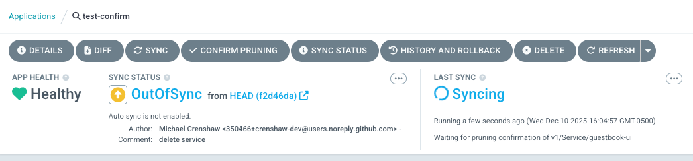

# Sync Options

* goal
  * ways / Argo CD can sync the desired state | target cluster

* Sync Options
  * ways to configure
    * | specific Kubernetes object 

      ```yaml
      metadata:
        annotations:
          argocd.argoproj.io/sync-options: syncOption1=syncOption1Value,syncOption2=syncOption2Value,...
      ```
    * | Application
      * -> affect ALL Kubernetes objects / managed -- by -- that Application
      * ways 
        * CRD

          ```yaml
          apiVersion: argoproj.io/v1alpha1
          kind: Application
          spec:
            syncPolicy:
              syncOptions:
              - syncOption1=syncOption1Value
              - syncOption2=syncOption2Value
              - ...
          ```
        * Argo CD CLI
        
          ```shell
          argocd app set <app-name> --sync-option <syncOptionName>=<value>
          ```

| Sync Option                     | Values                               | Scope                 | Description                                                                                                                                                         |
|---------------------------------|--------------------------------------|-----------------------|---------------------------------------------------------------------------------------------------------------------------------------------------------------------|
| **Prune**                       | `false`, `confirm`                   | Application, Resource | if/how resources are pruned <br/> `false` == NEVER prune <br/> `confirm` -> require MANUAL confirmation                                                             |
| **Delete**                      | `false`, `confirm`                   | Application, Resource | if/how resources are deleted <br/> `false` == NEVER delete <br/> `confirm` -> require MANUAL confirmation                                                           |
| **Validate**                    | `false`                              | Application, Resource | disable kubectl validation (`--validate=false`)                                                                                                                     |
| **SkipDryRunOnMissingResource** | `true`                               | Application, Resource | if CRD is NOT present \| cluster -> skip dry run <br/> out of the scope: CRD / ALREADY present                                                                      |
| **ApplyOutOfSyncOnly**          | `true`                               | Application           | Apply ONLY \| out-of-sync resources (selective sync)                                                                                                                |
| **PrunePropagationPolicy**      | `foreground`, `background`, `orphan` | Application           | \| prune, propagate deletion policy                                                                                                                                 |
| **PruneLast**                   | `true`                               | Application, Resource | AFTER ALL OTHER waves completed successfully & ALL OTHER resources deployed & healthy, prune resources -- as a -- FINAL IMPLICIT wave <br/> happens \| `sync` phase |
| **Replace**                     | `true`                               | Application, Resource | use `kubectl replace/create` instead of `kubectl apply` <br/> `kubectl apply` == default command \| sync                                                            |
| **Force**                       | `true`                               | Resource              | force resource recreation -- via -- `kubectl delete/create` (DESTRUCTIVE)                                                                                           |
| **ServerSideApply**             | `true`, `false`                      | Application, Resource | Use server-side apply -- instead of -- client-side apply                                                                                                            |
| **ClientSideApplyMigration**    | `true`, `false`                      | Application           | Enable/disable migration from client-side to server-side apply (default: enabled)                                                                                   |
| **FailOnSharedResource**        | `true`, `false` (default)            | Application           | if resource is ALREADY managed by ANOTHER Application -> fail sync                                                                                                  |
| **RespectIgnoreDifferences**    | `true`                               | Application           | \| sync phase, apply `ignoreDifferences` configs (!= ONLY `diff` calculation)                                                                                       |
| **CreateNamespace**             | `true`                               | Application           | if namespace / specified \| Application's `spec.destination.namespace` does NOT exist -> AUTO-create the namespace                                                  |

## `Prune`
### `Prune=false`

* ⚠️if Argo CD pull Git & detects that a resource should be pruned ALTHOUGH `Prune=false` -> app will be out of sync⚠️ 

* displayed | sync-status panel

    

* common use cases
  * \+ [compare options](compare-options.md)

### `Prune=confirm`

* goal
  * resources / ❌should NOT be pruned WITHOUT confirmation❌
    * use cases
      * critical resources
        * _Example:_ Namespaces
    * TILL it's NOT confirmed MANUALLY -> Application sync status == Syncing

* if you want to confirm the pruning -> MANUALLY -- via --
  * Argo CD UI
  * Argo CD CLI
  * applying | Argo CD Application,
    ```yaml
    metadata:
      annotations:
        argocd.argoproj.io/deletion-approved: <ISO formatted timestamp>
    ```

* | UI,
  * "Confirm Pruning" button AVAILABLE TILL complete the sync

    

## `Delete`
### `Delete=false`

* allows
    * ❌AFTER deleting your Application,
        * Kubernetes objects are NOT deleted❌
            * == stop cleaning up

* use cases
    * Persistent Volume Claims

### `Delete=confirm`

* goal
    * resources / ❌should NOT be deleted WITHOUT confirmation❌
        * use cases
            * critical resources
                * _Example:_ Namespaces
        * TILL it's NOT confirmed MANUALLY -> Application sync status == Syncing

* if you want to confirm the pruning -> MANUALLY -- via --
    * Argo CD UI
    * Argo CD CLI
    * applying | Argo CD Application,
      ```yaml
      metadata:
        annotations:
          argocd.argoproj.io/deletion-approved: <ISO formatted timestamp>
      ```

## `Validate`

* use case
  * Kubernetes objects / | apply them, NEED to skip validation (== `kubectl apply--validate=false`)
    * _Example:_ Kubernetes types / uses `RawExtension`
      * [ServiceCatalog](https://github.com/kubernetes-incubator/service-catalog/blob/master/pkg/apis/servicecatalog/v1beta1/types.go#L497)

## `SkipDryRunOnMissingResource` 

* goal
  * | [dry-run validation](sync-waves.md)

* use case
  * | sync a CR / NOT present | cluster
    * ways
      1. CRD manifest is part -- of the -- SAME sync
         * Argo CD skip dry-run AUTOMATICALLY   == NOT depend -- on -- this configuration
      2. CRD created -- via -- another way
         * _Example:_  -- via a -- controller | cluster
           * [gatekeeper](https://github.com/open-policy-agent/gatekeeper) creates CRDs -- based on -- user's response / found | `ConstraintTemplates`

* if you do NOT configure it -> Argo CD sync fails / throw `the server could not find the requested resource`
  * Reason: 🧠Argo CD can NOT find the CRD | sync🧠 

## `ApplyOutOfSyncOnly`

* use case
  * if Application manage 1k of Kubernetes objects -> takes long time + pressure | API server
    * Reason:🧠if you use auto sync -> Argo CD applies | EVERY Kubernetes object / managed -- by the -- Application🧠

## `PrunePropagationPolicy`

TODO: 
* By default, extraneous resources get pruned using the foreground deletion policy
* The propagation policy can be controlled
using the `PrunePropagationPolicy` sync option
* Supported policies are background, foreground, and orphan.
More information about those policies can be found in the Kubernetes 
[Garbage Collection](https://kubernetes.io/docs/concepts/workloads/controllers/garbage-collection/)

```yaml
apiVersion: argoproj.io/v1alpha1
kind: Application
spec:
  syncPolicy:
    syncOptions:
    - PrunePropagationPolicy=foreground
```

## `PruneLast`

* use case
  * blue-green deployments

```
┌──────────────────────────────────────────────────────────────────────────────────────────────────────────────────────────────────────────────────────────┐
│                                              PRUNING BEHAVIOR WITH PruneLast=true                                                                        │
│                                    (Shows implicit final wave for pruning in each applicable phase)                                                      │
└──────────────────────────────────────────────────────────────────────────────────────────────────────────────────────────────────────────────────────────┘

TIME →

┌──────────────────┬──────────────────┬──────────────────┬──────────────────┬──────────────────┬──────────────────┐
│    PRESYNC       │      SYNC        │    POSTSYNC      │    SYNCFAIL      │   PREDELETE      │   POSTDELETE     │
│   (hooks only)   │ (hooks+resources)│   (hooks only)   │   (hooks only)   │   (hooks only)   │   (hooks only)   │
├──────────────────┼──────────────────┼──────────────────┼──────────────────┼──────────────────┼──────────────────┤
│                  │                  │                  │                  │                  │                  │
│ Wave -1          │ Wave -1          │ Wave 0           │ Wave 0           │ Wave 0           │ Wave 0           │
│ ┌──────────────┐ │ ┌──────────────┐ │ ┌──────────────┐ │ ┌──────────────┐ │ ┌──────────────┐ │ ┌──────────────┐ │
│ │  🔧 Hook A   │ │ │  📦 Namespace│ │ │  🔧 Hook P   │ │ │  🔧 Hook X   │ │ │  🔧 Hook M   │ │ │  🔧 Hook Z   │ │
│ │  [execute]   │ │ │  [apply]     │ │ │  [execute]   │ │ │  [execute]   │ │ │  [execute]   │ │ │  [execute]   │ │
│ │  [cleanup]   │ │ │  [keep]      │ │ │  [cleanup]   │ │ │  [cleanup]   │ │ │  [cleanup]   │ │ │  [cleanup]   │ │
│ └──────────────┘ │ └──────────────┘ │ └──────────────┘ │ └──────────────┘ │ └──────────────┘ │ └──────────────┘ │
│        ↓         │        ↓         │        ↓         │        ↓         │        ↓         │        ↓         │
│     ⏱️ 2s        │     ⏱️ 2s        │     ⏱️ 2s        │     ⏱️ 2s        │     ⏱️ 2s        │     ⏱️ 2s        │
│        ↓         │        ↓         │        ↓         │        ↓         │        ↓         │        ↓         │
│                  │                  │                  │                  │                  │                  │
│ Wave 0           │ Wave 0           │ Wave 5           │ Wave 1           │ Wave 1           │                  │
│ ┌──────────────┐ │ ┌──────────────┐ │ ┌──────────────┐ │ ┌──────────────┐ │ ┌──────────────┐ │                  │
│ │  🔧 Hook B   │ │ │  📦 ConfigMap│ │ │  🔧 Hook Q   │ │ │  🔧 Hook Y   │ │ │  🔧 Hook N   │ │                  │
│ │  [execute]   │ │ │  [apply]     │ │ │  [execute]   │ │ │  [execute]   │ │ │  [execute]   │ │                  │
│ │  [cleanup]   │ │ │  [keep]      │ │ │  [cleanup]   │ │ │  [cleanup]   │ │ │  [cleanup]   │ │                  │
│ └──────────────┘ │ └──────────────┘ │ └──────────────┘ │ └──────────────┘ │ └──────────────┘ │                  │
│                  │ ┌──────────────┐ │                  │                  │                  │                  │
│                  │ │  📦 Secret   │ │                  │                  │                  │                  │
│                  │ │  [apply]     │ │                  │                  │                  │                  │
│                  │ │  [keep]      │ │                  │                  │                  │                  │
│                  │ └──────────────┘ │                  │                  │                  │                  │
│        ↓         │        ↓         │                  │                  │                  │                  │
│     ⏱️ 2s        │     ⏱️ 2s        │                  │                  │                  │                  │
│        ↓         │        ↓         │                  │                  │                  │                  │
│                  │                  │                  │                  │                  │                  │
│ Wave 1           │ Wave 1           │                  │                  │                  │                  │
│ ┌──────────────┐ │ ┌──────────────┐ │                  │                  │                  │                  │
│ │  🔧 Hook C   │ │ │  📦 Deploy   │ │                  │                  │                  │                  │
│ │  [execute]   │ │ │  [apply]     │ │                  │                  │                  │                  │
│ │  [cleanup]   │ │ │  [wait       │ │                  │                  │                  │                  │
│ └──────────────┘ │ │   healthy]   │ │                  │                  │                  │                  │
│                  │ │  [keep]      │ │                  │                  │                  │                  │
│                  │ └──────────────┘ │                  │                  │                  │                  │
│        ↓         │        ↓         │                  │                  │                  │                  │
│                  │     ⏱️ 2s        │                  │                  │                  │                  │
│                  │        ↓         │                  │                  │                  │                  │
│                  │                  │                  │                  │                  │                  │
│                  │ Wave 2           │                  │                  │                  │                  │
│                  │ ┌──────────────┐ │                  │                  │                  │                  │
│                  │ │  📦 Service  │ │                  │                  │                  │                  │
│                  │ │  [apply]     │ │                  │                  │                  │                  │
│                  │ │  [keep]      │ │                  │                  │                  │                  │
│                  │ └──────────────┘ │                  │                  │                  │                  │
│                  │        ↓         │                  │                  │                  │                  │
│                  │                  │                  │                  │                  │                  │
│                  │ ✅ All waves     │                  │                  │                  │                  │
│                  │   completed &    │                  │                  │                  │                  │
│                  │   healthy        │                  │                  │                  │                  │
│                  │        ↓         │                  │                  │                  │                  │
│                  │ ╔══════════════╗ │                  │                  │                  │                  │
│                  │ ║ PRUNE PHASE  ║ │                  │                  │                  │                  │
│                  │ ║ (IMPLICIT    ║ │                  │                  │                  │                  │
│                  │ ║  FINAL wave) ║ │                  │                  │                  │                  │
│                  │ ╠══════════════╣ │                  │                  │                  │                  │
│                  │ ║ 🗑️ old-cm    ║ │                  │                  │                  │                  │
│                  │ ║   [prune]    ║ │                  │                  │                  │                  │
│                  │ ║              ║ │                  │                  │                  │                  │
│                  │ ║ 🗑️ old-secret║ │                  │                  │                  │                  │
│                  │ ║   [prune]    ║ │                  │                  │                  │                  │
│                  │ ║              ║ │                  │                  │                  │                  │
│                  │ ║ 🗑️ old-deploy║ │                  │                  │                  │                  │
│                  │ ║   [prune]    ║ │                  │                  │                  │                  │
│                  │ ╚══════════════╝ │                  │                  │                  │                  │
│                  │        ↓         │                  │                  │                  │                  │
└──────────────────┴──────────────────┴──────────────────┴──────────────────┴──────────────────┴──────────────────┘
        ↓                  ↓                  ↓            (only if           (only on          (only on
   Phase ends        Phase ends        Phase ends       sync fails)        app delete)       app delete)
        ↓                  ↓                  ↓                  ↓                  ↓                  ↓
        └──────────────────┴──────────────────┴──────────────────┴──────────────────┴──────────────────┘
                                                    ↓
                                        SYNC OPERATION COMPLETE

════════════════════════════════════════════════════════════════════════════════════════════════════════════════════

LEGEND:
───────
🔧 = Sync Hook (ephemeral)
📦 = Normal Resource (permanent)
🗑️ = Extraneous resource being pruned
⏱️ = Delay between waves (2 seconds)
╔═══╗ = Implicit final wave (PruneLast)
```

## `Replace`

* use cases
  * those / ❌`kubectl apply` is NOT suitable❌
    * _Example:_ resource spec is TOO large / will NOT fit | `kubectl.kubernetes.io/last-applied-configuration` (annotation / added -- by -- `kubectl apply`)

* `Replace=true`
  * cons
    * downtime
      * Reason:🧠delete ALL & AFTER recreate -- from -- scratch🧠

* recommendations
  * ❌NOT use | production❌

## `Force`

* use cases
  * job resources / should run EVERY time | sync

* `Replace=true`
  * cons
    * downtime
      * Reason:🧠delete ALL & AFTER recreate -- from -- scratch🧠

## `ServerSideApply`

* enables Kubernetes [Server-Side Apply](https://kubernetes.io/docs/reference/using-api/server-side-apply/)

TODO: 
By default, Argo CD executes the `kubectl apply` operation to apply the configuration stored in Git.
This is a client side operation that relies on the `kubectl.kubernetes.io/last-applied-configuration`
annotation to store the previous resource state.

However, there are some cases where you want to use `kubectl apply --server-side` over `kubectl apply`:

- Resource is too big to fit in 262144 bytes allowed annotation size. In this case
  server-side apply can be used to avoid this issue as the annotation is not used in this case.
- Patching of existing resources on the cluster that are not fully managed by Argo CD.
- Use a more declarative approach, which tracks a user's field management, rather than a user's last
  applied state.

If the `ServerSideApply=true` sync option is set, Argo CD will use the `kubectl apply --server-side --force-conflicts`
command to apply changes.

ServerSideApply can also be used to patch existing resources by providing a partial
yaml
* For example, if there is a requirement to update just the number of replicas
in a given Deployment, the following yaml can be provided to Argo CD:

```yaml
apiVersion: apps/v1
kind: Deployment
metadata:
  name: my-deployment
spec:
  replicas: 3
```

Note that by the Deployment schema specification, this isn't a valid manifest
* In this
case an additional sync option *must* be provided to skip schema validation
* The example
below shows how to configure the application to enable the two necessary sync options:

```yaml
apiVersion: argoproj.io/v1alpha1
kind: Application
spec:
  syncPolicy:
    syncOptions:
    - ServerSideApply=true
    - Validate=false
```

In this case, Argo CD will use the `kubectl apply --server-side --force-conflicts --validate=false` command
to apply changes.

* ⚠️[`Replace=true`](#replace)'s priority > `ServerSideApply=true`'s priority⚠️

### Client-Side Apply Migration

Argo CD supports client-side apply migration, which helps transitioning from client-side apply to server-side apply by moving a resource's managed fields from one manager to Argo CD's manager
* This feature is particularly useful when you need to migrate existing resources that were created using kubectl client-side apply to server-side apply with Argo CD.

By default, client-side apply migration is enabled
* You can disable it using the sync option:

```yaml
apiVersion: argoproj.io/v1alpha1
kind: Application
spec:
  syncPolicy:
    syncOptions:
    - ClientSideApplyMigration=false
```

You can specify a custom field manager for the client-side apply migration using an annotation:

```yaml
apiVersion: argoproj.io/v1alpha1
kind: Application
metadata:
  annotations:
    argocd.argoproj.io/client-side-apply-migration-manager: "my-custom-manager"
```

This is useful when you have other operators managing resources that are no longer in use and would like Argo CD to own all the fields for that operator.

### How it works

When client-side apply migration is enabled:
1. Argo CD will use the specified field manager (or default if not specified) to perform migration
2. During a server-side apply sync operation, it will:
   - Check if the specified field manager exists in the resource's `managedFields` with `operation: Update` (indicating client-side apply)
   - Patch the `managedFields`, transferring field ownership from the client-side apply manager to Argo CD's server-side apply manager (`argocd-controller`)
   - Remove the client-side apply manager entry from `managedFields`
   - Perform the server-side apply with the migrated field ownership

This feature is based on Kubernetes' [client-side to server-side apply migration](https://kubernetes.io/docs/reference/using-api/server-side-apply/#migration-between-client-side-and-server-side-apply).

## `FailOnSharedResource`

* use cases
  * MULTIPLE ApplicationS manage SAME Kubernetes objects

* if `FailOnSharedResource` ==
  * `false` -> | sync, Argo CD will apply ALL manifests / found | git
  * `true` -> | sync, Argo CD will fail

## `RespectIgnoreDifferences`

* [`ignoreDifferences`](../operator-manual/reconcile.md)
* [diff strategies](diff-strategies.md)
* ⚠️requirements⚠️
  * resource is ALREADY created | cluster

## `CreateNamespace`

* if namespace / specified \| Application's `spec.destination.namespace` does NOT exist -> Application will fail to sync

* requirements
  * ⚠️Application's child manifests' `metadata.namespace`
    * be omitted, OR
    * == Application's `spec.destination.namespace`⚠️

### Namespace Metadata

* `syncPolicy.managedNamespaceMetadata`
  * allows
    * sets the metadata -- for the -- Application's child's namespace
  * requirements
    * ⚠️syncPolicy.syncOptions:CreateNamespace=true⚠️
  * recommendations
    * [track it](resource_tracking.md)
      * ⚠️ONLY scenario | add resource-tracking annotation | namespace⚠️
        * Reason:🧠
          * OTHER cases, interfere -- with -- Argo CD’s internal resource-tracking and ownership logic
          * namespace == cluster-scoped resource🧠

* if Application's child's namespace ALREADY exist & ALREADY have metadata -> 
  * steps
    * [upgrade the resource -- to -- server-side apply](https://kubernetes.io/docs/reference/using-api/server-side-apply/#upgrading-from-client-side-apply-to-server-side-apply)
      * Reason:🧠
        * Argo CD relies on `kubectl` / does NOT support managing client-side-applied resources -- via -- server-side-applies
        * OTHERWISE, Argo CD may remove EXISTING labels/annotations🧠 
    * enable `managedNamespaceMetadata`
  * ⚠️EXISTING namespace's metadata's priority > `syncPolicy.managedNamespaceMetadata`'s priority⚠️
    * == EXISTING namespace's metadata's priority take preference / overwrite others
