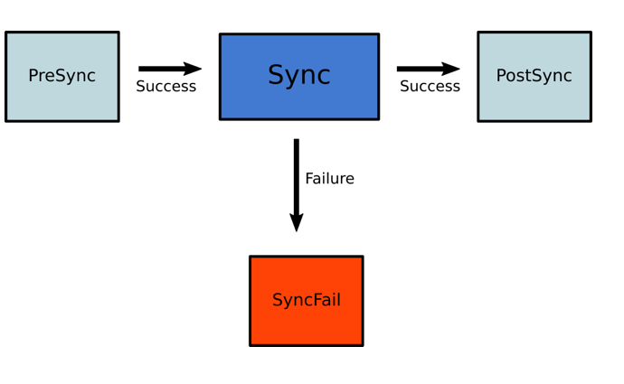
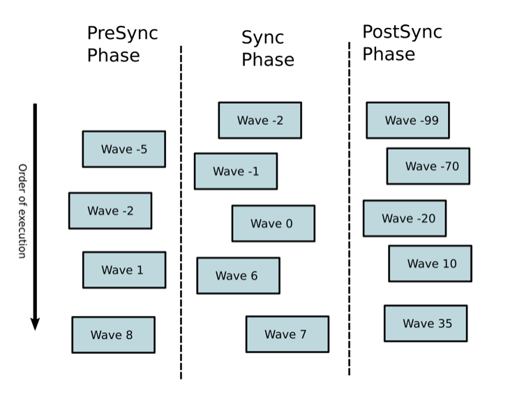

# Sync Phases and Waves

* Sync phases & hooks
  * allows
    * defining when apply the resources
      * _Example:_ before or after the main sync operation
  * uses
    * define 
      * jobs
      * any resource to run OR be applied | ANY specific order

* Argo CD's built-in hook types

| Hook         | Description                                                                                                                                                                        |
|--------------|------------------------------------------------------------------------------------------------------------------------------------------------------------------------------------|
| `PreSync`    | Executes PREVIOUS -- to the -- application of the manifests                                                                                                                        |
| `Sync`       | Executes AFTER ALL `PreSync` hooks completed & successful / SAME time -- as the -- application of the manifests                                                                    |
| `Skip`       | == skip the application of the manifest                                                                                                                                            |
| `PostSync`   | TODO: Executes AFTER ALL `Sync` hooks completed & successful, a successful application, and all resources in a `Healthy` state.                                                    |
| `SyncFail`   | Executes \| sync operation fails  <br/> uses: cleanup actions + other housekeeping tasks  <br/> if it fails -> Argo CD does NOT do anything special                                |
| `PreDelete`  | Executes BEFORE deleting ALL Application resources <br/> _Example:_ `kubectl delete application` OR `argocd app delete` <br/> != \| normal sync operations (EVEN pruning enabled ) |
| `PostDelete` | Executes AFTER deleting ALL Application resources <br/> requirements: v2.10+                                                                                                       |

* if you add "argocd.argoproj.io/hook" annotation | resource -> will assign it | specific phase
* | Sync operation,
  * Argo CD will apply the resource | appropriate phase of the deployment
* Hooks
  * == any type of Kubernetes resource kind
    * NORMALLY: Pod, Job or Argo Workflows
* Multiple hooks
  * == hook1,hook2, ...

## How phases work?

* Argo CD
  * respect resources -- assigned to -- DIFFERENT phases

* | sync operation,
  * Argo CD will do
    1. Apply ALL resources / marked -- as -- PreSync hooks
       * if any of them fail -> the whole sync process will
         * stop
         * be marked -- as -- failed
    2. Apply ALL resources / marked -- as -- Sync hooks
       * if any of them fails -> the whole sync process will be marked -- as -- failed
       * Hooks / marked with SyncFail -> will ALSO run
    3. Apply ALL resources / marked -- as -- PostSync hooks
       * if any of them fails -> the whole sync process will be marked -- as -- failed

* Hooks / marked with Skip
  * -> will NOT be applied

* sync process

    

  * use cases
    * essential check -- as a -- PreSync hook
      * if it fails -> whole sync operation will stop
        * _Example:_ prevent the deployment taking place
    * smoke tests -- as -- PostSync hooks
      * if they succeed -> your application has passed the validation
      * if they fail -> whole deployment will be marked -- as -- failed
        * Argo CD can notify you / take further actions

* | selective sync operation,
  * hooks do NOT run 

## Hook lifecycle and cleanup

* Argo CD
  * provides
    * several methods to: clean up hooks & how much history will be kept -- for -- previous runs
      * way1: when a hook will be deleted -- via -- `argocd.argoproj.io/hook-delete-policy`
        * ALLOWED values

| Policy               | Description                                                                                                                                                                                              |
|----------------------|----------------------------------------------------------------------------------------------------------------------------------------------------------------------------------------------------------|
| `HookSucceeded`      | AFTER the hook succeeded (_Example:_ Job/Workflow completed successfully), delete the hook resource                                                                                                      |
| `HookFailed`         | AFTER the hook failed, delete the hook resource                                                                                                                                                          |
| `BeforeHookCreation` | requirements: v1.3 <br/> BEFORE creating the NEW one, the existing hook resource is deleted <br/> used + `/metadata/name` <br/> default one <br/> &nbsp;&nbsp; == if NO is specified -> this one is used |

## PreDelete and PostDelete Hooks

### PreDelete Hooks

* TODO: 

**Behavior:**

1. When an Application is deleted, Argo CD checks for PreDelete hooks defined in the Application's manifests
2. If PreDelete hooks exist, they are created and executed before any Application resources are deleted
3. Argo CD waits for all PreDelete hooks to reach a Healthy state before proceeding with deletion
4. Once all PreDelete hooks complete successfully, they are cleaned up and the Application resources are deleted

**Failure Handling:**

If a PreDelete hook fails (e.g., a Job fails or a Pod crashes), the Application deletion is blocked:

- The Application will remain in a deleting state with a `DeletionError` condition
- Application resources will not be deleted until the hook succeeds
- The user can fix the failing hook by updating its manifest in the git repository
- After fixing the hook, Argo CD will automatically retry the deletion on the next reconciliation
- Alternatively, the user can manually delete the failing hook resource to allow deletion to proceed

### PostDelete Hooks

PostDelete hooks execute after all Application resources have been deleted. They are useful for cleanup operations, notifications, or removing external resources.

**Behavior:**

1. Application resources are deleted first
2. Once all Application resources are fully removed, PostDelete hooks are created and executed
3. Argo CD waits for all PostDelete hooks to reach a Healthy state
4. Once all PostDelete hooks complete successfully, they are cleaned up and the Application is fully removed

**Failure Handling:**

If a PostDelete hook fails:

- The Application is already deleted from the cluster, but the Application CR remains with a `DeletionError` condition
- The user can fix the failing hook by updating its manifest in the git repository
- After fixing the hook, Argo CD will automatically retry on the next reconciliation
- Alternatively, the user can manually delete the failing hook resource to complete the Application deletion

## How sync waves work?

* Argo CD 
  * sync order execution
    * 👀defined -- by -- `argocd.argoproj.io/sync-wave` annotation👀
      * Hooks & resources,
        * 👀by default, 0👀
  * sync operation
    1. order ALL resources -- based on -- their wave
       * lowest -- to -- highest
    2. Apply the resources -- based on -- sync order execution 

* `argocd.argoproj.io/sync-wave`
  * == integer /
    * start deploying FROM the lowest -- to -- the highest number
    * ⚠️ALLOWED ALSO <0⚠️

* TODO: 
There is currently a delay between each sync wave in order to give other controllers a chance to react to the spec change that was just applied
* This also prevents Argo CD from assessing resource health too quickly (against the stale object), causing hooks to fire prematurely
* The current delay between each sync wave is 2 seconds and can be configured via the environment variable ARGOCD_SYNC_WAVE_DELAY.

## Combining Sync waves and hooks

While you can use sync waves on their own, for maximum flexibility you can combine them with hooks. This way you can use sync phases for coarse grained ordering and sync waves for defining the exact order of a resource within an individual phase.



When Argo CD starts a sync, it orders the resources in the following precedence:

1. The phase
2. The wave they are in (lower values first)
3. By kind (e.g. namespaces first and then other Kubernetes resources, followed by custom resources)
4. By name

Once the order is defined:

1. First Argo CD determines the number of the first wave to apply. This is the first number where any resource is out-of-sync or unhealthy.
2. It applies resources in that wave.
3. It repeats this process until all phases and waves are in-sync and healthy.

Because an application can have resources that are unhealthy in the first wave, it may be that the app can never get to healthy.

## How Do I Configure Phases?

Pre-sync and post-sync can only contain hooks. Apply the hook annotation:

```yaml
metadata:
  annotations:
    argocd.argoproj.io/hook: PreSync
```

[Read more about hooks](resource_hooks.md).

## How Do I Configure Waves?

Specify the wave using the following annotation:

```yaml
metadata:
  annotations:
    argocd.argoproj.io/sync-wave: "5"
```

Hooks and resources are assigned to wave zero by default. The wave can be negative, so you can create a wave that runs before all other resources.

## Examples

### Work around ArgoCD sync failure
TODO: 

* use case
  * | upgrade ingress-nginx controller (/ managed by helm) -- via -- ArgoCD 2.x,
    * SOMETIMES fails

| .         | .                                                                       |
|-----------|-------------------------------------------------------------------------|
| OPERATION | Sync                                                                    |
| PHASE     | Running                                                                 |
| MESSAGE   | waiting for completion of hook batch/Job/ingress-nginx-admission-create |

| .         | .                              |
|-----------|--------------------------------|
| KIND      | batch/v1/Job                   |
| NAMESPACE | ingress-nginx                  |
| NAME      | ingress-nginx-admission-create |
| STATUS    | Running                        |
| HOOK      | PreSync                        |
| MESSAGE   | Pending deletion               |

* SOLUTION:
  * TODO: helm user can add:

```yaml
ingress-nginx:
  controller:
    admissionWebhooks:
      annotations:
        argocd.argoproj.io/hook: Skip
```

Which results in a successful sync.
